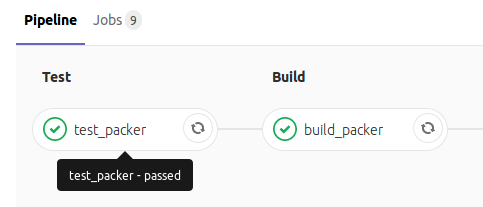
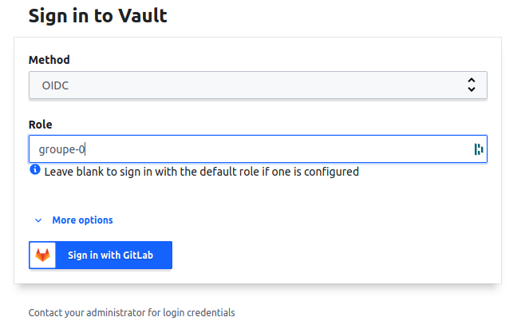
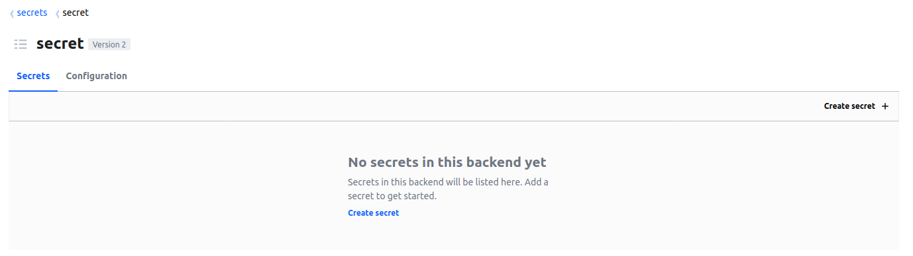
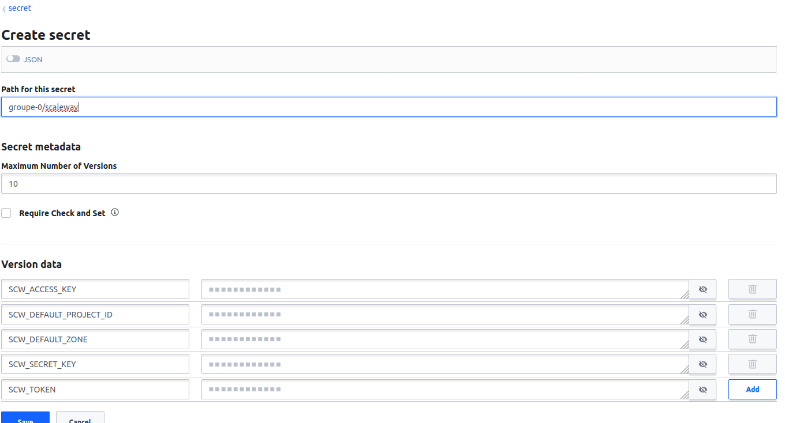

# Build d'une image VM automatiquement via Packer et Gitlab CI

## Documentation

*  Gitlab: https://docs.gitlab.com/ee/ci/introduction/
*  Gitlab CI predefined variables : https://gitlab.com/help/ci/variables/predefined_variables.md
*  API Scaleway: https://developers.scaleway.com/en/products/instance/api/#introduction
*  Packer:
   *  Liste des images pour récupérer l'id: https://api-marketplace.scaleway.com/images
   *  Scaleway builder: https://www.packer.io/docs/builders/scaleway.html
   *  Ansible provisionner: https://www.packer.io/docs/provisioners/ansible-local.html
   *  Shell provionner: https://www.packer.io/docs/provisioners/shell.html

## Packer

0. Cours sur Packer
1. Créez une nouvelle issue nommée `Création d'une image VM Scaleway avec Packer` puis créez sa Merge Request. Ensuite pullez le code, et changez de branche pour utiliser la nouvelle branche
2. Nous allons utiliser l'image `cf44b8f5-77e2-42ed-8f1e-09ed5bb028fc` (Ubuntu 20.04), le commercial_type `DEV1-S`, le ssh_username `root`
3. Template pour le fichier `packer/packer.json`:

   ```json
   {
     "variables": {
       ...
     },
     "builders": [
       {
         "type":"scaleway",
         "remove_volume": true,
         ...
       }
     ],
     "provisioners": [
       {
         "type": "shell",
         "inline": [
           ...
         ]
       }
     ]
   }
   ```

4. Packer doit récupérer une variable d'environnement nommée `IMAGE_TAG` afin de rendre unique le nome de l'image. Nous utiliserons plus tard le numéro de commit ou le tag git. Se référer à la doc : https://www.packer.io/docs/templates/user-variables.html#environment-variables
5. Nommer l'image comme ceci: `` "image_name": "ubuntu-hitema-{{user `image_tag`}}" ``
6. Via le `provisioners` de type `shell`
   - Mettre à jour les packages de l'OS
   - Installer Docker Engine
   - Installer les packages `git` et `parted` et `vim`
   - Installer une authorité de certification SSH (détail plus tard)
   - Nettoyer les caches APT et fichiers temporaires
     ```json
     "sleep 30",
     "apt-get update",
     "DEBIAN_FRONTEND=noninteractive apt-get -y -o Dpkg::Options::=\"--force-confdef\" -o Dpkg::Options::=\"--force-confold\" dist-upgrade",
     "DEBIAN_FRONTEND=noninteractive apt-get install -y -o Dpkg::Options::=\"--force-confdef\" -o Dpkg::Options::=\"--force-confold\" curl apt-transport-https linux-image-generic-hwe-20.04 linux-headers-generic-hwe-20.04 byobu git parted sudo vim",
     "DEBIAN_FRONTEND=noninteractive apt-get -y remove linux-image-generic",
     "apt-get update && apt-get install -y -qq --no-install-recommends docker.io python3-docker",
     "usermod -aG docker ubuntu",
     "DEBIAN_FRONTEND=noninteractive apt-get autoclean && apt-get -y autoremove && rm -rf /var/lib/apt/lists/*",
     "echo \"TrustedUserCAKeys /etc/ssh/trusted-user-ca-keys.pem\" > /etc/ssh/sshd_config.d/vault.conf",
     "curl -o /etc/ssh/trusted-user-ca-keys.pem https://vault-hitema.doca.cloud/v1/ssh/public_key",
     "chmod 644 /etc/ssh/sshd_config.d/vault.conf /etc/ssh/trusted-user-ca-keys.pem" 
     ```
7. Pour tester en local depuis le terminal de code-hitema avant de commiter :
   - Exportez les les variables d'environnement nécessaire à l'exécution de Packer :
     ```bash
     export SCW_DEFAULT_PROJECT_ID=<votre project_id>
     export SCW_DEFAULT_ORGANIZATION_ID=<votre project_id>
     export SCW_ACCESS_KEY=<votre access key>
     export SCW_SECRET_KEY=<votre secret key>
     export SCW_DEFAULT_ZONE=fr-par-1
     export IMAGE_TAG=0.0.1
     ```
   - Puis :
     ```bash
     cd packer
     packer validate packer.json
     packer build packer.json
     ```
8. Demandez une revue de code à votre professeur, puis une fois la Merge Request approuvée, mergez la branche puis taguez la branche master en `1.0.0`

Tip: 
``` git tag -a v1.0.0
git push origin v1.0.0 
```

## Packer dans Gitlab CI

0. Cours sur Gitlab CI
1. Intégration de Packer à Gitlab CI dans le fichier `.gitlab-ci.yml` du dépôt `image` :
   - Pour tous les jobs, utiliser l'image Docker `captnbp/gitlab-ci-image:v2.9.5`
   - Ajoutez le `before_script` suivant à votre fichier `.gitlab-ci.yml`
     ```yaml
       before_script:
         - |
           if [[ -z "$CI_COMMIT_TAG" ]]; then
             export IMAGE_TAG=${CI_COMMIT_SHA}
           else
             export IMAGE_TAG=${CI_COMMIT_TAG}
           fi
     ```
   - Créer un stage `test`
   - Créer un job `test_packer` dans le stage `test` qui validera la syntaxe Packer (https://www.packer.io/docs/commands/validate)
   - Créer un stage `build`
   - Créer un job `build_packer` dans le stage `build` qui buildera l'image Packer (https://www.packer.io/docs/commands/build)
      
      
   - Aller vérifier que l'image a été créée dans https://console.scaleway.com/instance/images

## Stockage des secrets Scaleway dans Hashicorp Vault

Afin de mieux sécuriser les clés d'API Scaleway, nous allons les stocker dans Hashicorp Vault (un secret manager incontournable !) et faire en sorte que Gitlab CI aille lire les clés d'API dans Vault lors de l'exécution de notre pipeline précédement créé.

> **Attention :** Si vous avez l'erreur `The provider window was closed before authentication was complete. Please click Sign In to try again.` c'est que votre navigateur ou une extension du navigateur bloque les popups. A vous de corriger de votre côté.

0. Connectez-vous à https://vault-hitema.doca.cloud/ui/vault/secrets/secret/list (Method = `OIDC`, Role = `groupe-<group_number>`)
    
    
1. Créez un nouveau secret ayant comme path `groupe-<group_number>/scaleway` et ajoutez les variables suivantes :
   - **SCW_DEFAULT_PROJECT_ID** : Votre Project ID Scaleway (https://console.scaleway.com/project/settings)
   - **SCW_DEFAULT_ORGANIZATION_ID** : Votre Project ID Scaleway (https://console.scaleway.com/project/settings)
   - **SCW_ACCESS_KEY** : Votre Access key Scaleway
   - **SCW_SECRET_KEY** : Votre Secret key Scaleway
   - **SCW_DEFAULT_ZONE** : fr-par-1
    
2. Supprimez les variables correspondantes dans le dépôts Gitlab `image` : `Settings -> CI / CD -> Variables`.
3. Créez une nouvell issue nommée `Migration vers Vault` puis créez sa Merge Request. Ensuite pullez le code, et changez de branche pour utiliser la nouvelle branche
4. Ajoutez une variable globale à votre fichier `.gitlab-ci.yml` :
   ```yaml
   variables:
     VAULT_ADDR: https://vault-hitema.doca.cloud:443
   ```
5. Complétez votre `before_script` suivant à votre fichier `.gitlab-ci.yml` avec (pensez à remplacer le numéro de groupe):
   ```yaml
   before_script:
     - |
       if [[ -z "$CI_COMMIT_TAG" ]]; then
         export IMAGE_TAG=${CI_COMMIT_SHA}
       else
         export IMAGE_TAG=${CI_COMMIT_TAG}
       fi
       export VAULT_TOKEN="$(vault write -field=token auth/jwt/login role=packer-groupe-<group_number> token_ttl=30 jwt=$CI_JOB_JWT)"
       export SCW_DEFAULT_PROJECT_ID="$(vault kv get -field=SCW_DEFAULT_PROJECT_ID secret/groupe-<group_number>/scaleway)"
       export SCW_DEFAULT_ORGANIZATION_ID="$(vault kv get -field=SCW_DEFAULT_PROJECT_ID secret/groupe-<group_number>/scaleway)"
       export SCW_ACCESS_KEY="$(vault kv get -field=SCW_ACCESS_KEY secret/groupe-<group_number>/scaleway)"
       export SCW_SECRET_KEY="$(vault kv get -field=SCW_SECRET_KEY secret/groupe-<group_number>/scaleway)"
       export SCW_DEFAULT_ZONE="$(vault kv get -field=SCW_DEFAULT_ZONE secret/groupe-<group_number>/scaleway)"
       export SCW_TOKEN="$(vault kv get -field=SCW_SECRET_KEY secret/groupe-<group_number>/scaleway)"
     ```
6. Aller vérifier que l'image a été créée dans https://console.scaleway.com/instance/images
7. Demandez une revue de code à votre professeur, puis une fois la Merge Request approuvée, mergez la branche puis taguez la branche master en `1.0.1`
