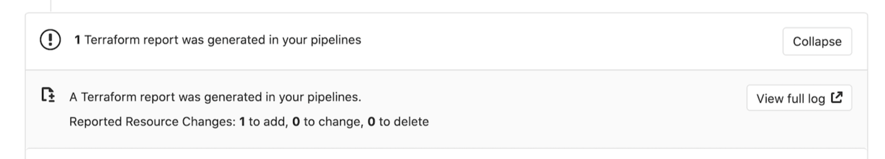

# Création de 2 infrastructures automatiquement via Terraform

Nous souhaitons construire automatiquement notre datacenter/infrastructure qui va héberger notre application.

Pour cela vous allez déployer votre infratructure avec l'outil Terraform dans votre projet dédié Scaleway.

Notre application a besoin d'une VM Ubuntu utilisant l'image VM que nous avons buildée avec Packer, une base de données Postgresql, des règles de Firewall strictes, un volume de 30Go pour stocker les données de l'application.

Voici le détail :
- Une variable `environnement` passée en argument lors de l'exécution de Terraform.
- Une variable `image` passée en argument lors de l'exécution de Terraform.
- Une ip publique pour notre VM et lui assigner
- Une VM :
  - Type de VM : `DEV1-S`
  - Nom : variable `environnement`
  - Image OS : variable `image`
  - Activer IPv6 sur la VM
  - Tags : hitema,group-<group number>,variable `environnement`
  - L'option suivante activée dans la VM de type `scaleway_instance_server` :
    ```hcl
    root_volume {
      delete_on_termination = true
    }
    ```
- Créer un groupe de sécurité (attaché à la VM) qui va contenir les règles suivantes :
  - Nom : variable `environnement`
  - Inbound : policy par défaut -> drop
    - Port TCP 22 (SSH) depuis `0.0.0.0/0`
    - Port TCP 80 (HTTP) depuis `0.0.0.0/0`
    - Port TCP 443 (HTTPS) depuis `0.0.0.0/0`
  - Outbound : policy par défaut -> accept
- Un volume de données :
  - Nom : variable `environnement`
  - Taille : 30Go
  - Type : `b_ssd`

Nous voulons aussi pouvoir supprimer notre infrastructure puisse être supprimée d'un simple click dans la liste des environnements Gitlab pour ne pas consommer en dehors des heures de la journée de TP.

## Documentation

- Gitlab: https://docs.gitlab.com/ee/ci/introduction/
- Terraform: https://www.terraform.io/docs/providers/scaleway/index.html
- Terraform states in Gitlab CI HTTP backend : https://docs.gitlab.com/ee/user/infrastructure/terraform_state.html#get-started-using-gitlab-ci

## Terraform

0. Cours sur Terraform
1. Créez une nouvelle issue nommée `Création d'une infrastructure Scaleway avec Terraform` puis créez sa Merge Request dans le dépôt `infrastructure`. Ensuite clonez le code de votre dépôt `infrastructure`, et changez de branche pour utiliser la nouvelle branche
2. A partir des spécifications ci-dessus, créez le fichier `terraform/main.tf` et ajoutez l'ensemble des resources nécessaires pour créer notre infrastructure. 
   
   Voici le début qui déclare les 2 variables à passer en argument de la commande terraform et l'import du plugin de provide Terraform à la bonne version :
   ```hcl
   variable image {}
   variable environnement {}
 
   terraform {
     required_providers {
       scaleway = {
         source = "scaleway/scaleway"
         version = "1.17.0"
       }
     }
   }
   ```
3. Pour tester en local depuis le terminal de code-hitema avant de commiter :
   - Ouvrez la page https://vault-hitema.doca.cloud/ui/ et récupérez votre `VAULT_TOKEN` :

     
     
   - Créez la variable d'environnement dans le Terminal de Code-Hitema :
     ```bash
     export VAULT_TOKEN=<Le token précédement récupéré>
     export GROUPE_NUMBER=<groupe number>
     ```
   - Exportez les les variables d'environnement nécessaire à l'exécution de Terraform :
     ```bash
     export SCW_DEFAULT_PROJECT_ID=$(vault read -field=SCW_DEFAULT_PROJECT_ID secret/groupe-${GROUPE_NUMBER}/scaleway)
     export SCW_DEFAULT_ORGANIZATION_ID=$(vault read -field=SCW_DEFAULT_ORGANIZATION_ID secret/groupe-${GROUPE_NUMBER}/scaleway)
     export SCW_ACCESS_KEY=$(vault read -field=SCW_ACCESS_KEY secret/groupe-${GROUPE_NUMBER}/scaleway)
     export SCW_SECRET_KEY=$(vault read -field=SCW_SECRET_KEY secret/groupe-${GROUPE_NUMBER}/scaleway)
     export SCW_DEFAULT_ZONE=$(vault read -field=SCW_DEFAULT_ZONE secret/groupe-${GROUPE_NUMBER}/scaleway)
     export SCW_DEFAULT_REGION=$(vault read -field=SCW_DEFAULT_REGION secret/groupe-${GROUPE_NUMBER}/scaleway)
     export SCW_IMAGE=$(scw instance image list name=ubuntu-hitema-1.0.1 -o json | jq -r ".[0].ID")
     ```
   - Puis :
     ```bash
     cd terraform
     terraform init
     terraform validate -var image=${SCW_IMAGE} -var environnement="cli"
     terraform plan -var image=${SCW_IMAGE} -var environnement="cli"
     terraform apply -var image=${SCW_IMAGE} -var environnement="cli"
     ```
4. Une fois votre infrastructure déployée avec succès, récupérez l'adresse IP de votre VM dans l'interface Scaleway (https://console.scaleway.com/instance/servers)
   ```bash
   vault write -field=signed_key ssh/sign/students public_key=@$HOME/.ssh/id_ed25519.pub > $HOME/.ssh/id_ed25519-cert.pub
   ssh -i $HOME/.ssh/id_ed25519-cert.pub -i $HOME/.ssh/id_ed25519 root@<Addresse IP de votre VM>
   ```
5. Faites une petite démo à votre professeur si ça a marché !
6. Maintenant que votre déploiement Terraform est fonctionnel en test, nous allons le **destroy** pour passer à l'industrialisation :
   ```bash
   terraform destroy -var image=${SCW_IMAGE}" -var environnement="cli"
   ```
7. Enfin commitez dans votre branche votre fichier `terraform/main.tf`

## Intégration à Gitlab CI pour gérer automatiquement l'infrastructure

0. Créez le fichier `.gitignore` à la racine de votre dépôt `infrastructure`
   ```
   terraform/.terraform
   terraform/terraform.tfstate
   terraform/terraform.tfstate.backup
   ```
1. Modifiez votre fichier `terraform/main.tf` pour ajouter la ligne `backend "http" {}` :
   ```hcl
   variable image {}
   variable environnement {}
 
   terraform {
     backend "http" {}
     required_providers {
       scaleway = {
         source = "scaleway/scaleway"
         version = "1.17.0"
       }
     }
   }
   ```
2. Intégration de Terraform à Gitlab CI dans le fichier `.gitlab-ci.yml` du dépôt `infrastructure`. Créez le `.gitlab-ci.yml` suivant :
   ```yaml
   default:
     image: captnbp/gitlab-ci-image:v2.9.7

     cache:
       key: production
       paths:
         - ${TF_ROOT}/.terraform

   variables:
     VAULT_ADDR: https://vault-hitema.doca.cloud:443
     TF_ROOT: ${CI_PROJECT_DIR}/terraform
     TF_ADDRESS: ${CI_API_V4_URL}/projects/${CI_PROJECT_ID}/terraform/state/production

   before_script:
     - cd ${TF_ROOT}
     - export VAULT_TOKEN="$(vault write -field=token auth/jwt/login role=infrastructure-groupe-<group_number> token_ttl=30 jwt=$CI_JOB_JWT)"
     - export SCW_DEFAULT_PROJECT_ID="$(vault kv get -field=SCW_DEFAULT_PROJECT_ID secret/groupe-<group_number>/scaleway)"
     - export SCW_DEFAULT_ORGANIZATION_ID="$(vault kv get -field=SCW_DEFAULT_PROJECT_ID secret/groupe-<group_number>/scaleway)"
     - export SCW_ACCESS_KEY="$(vault kv get -field=SCW_ACCESS_KEY secret/groupe-<group_number>/scaleway)"
     - export SCW_SECRET_KEY="$(vault kv get -field=SCW_SECRET_KEY secret/groupe-<group_number>/scaleway)"
     - export SCW_TOKEN="$(vault kv get -field=SCW_SECRET_KEY secret/groupe-<group_number>/scaleway)"
     - export SCW_DEFAULT_ZONE="$(vault kv get -field=SCW_DEFAULT_ZONE secret/groupe-<group_number>/scaleway)"
     - export SCW_DEFAULT_REGION="$(vault kv get -field=SCW_DEFAULT_REGION secret/groupe-<group_number>/scaleway)"
     - export SCW_IMAGE=$(scw instance image list name=ubuntu-hitema-1.0.1 -o json | jq -r ".[0].ID")

   stages:
     - prepare
     - validate
     - plan
     - deploy

   init:
     stage: prepare
     script:
       - gitlab-terraform init

   validate:
     stage: validate
     script:
       - gitlab-terraform validate -var image=${SCW_IMAGE} -var environnement="production"

   plan:
     stage: plan
     script:
       - gitlab-terraform plan -var image=${SCW_IMAGE} -var environnement="production"
       - gitlab-terraform plan-json  -var image=${SCW_IMAGE} -var environnement="production"
     artifacts:
       name: plan
       paths:
         - ${TF_ROOT}/plan.cache
       reports:
         terraform: ${TF_ROOT}/plan.json

   apply:
     stage: deploy
     environment:
       name: production
     script:
       - gitlab-terraform apply
     dependencies:
       - plan
     when: manual
     only:
       - master
   ```
3. Commitez et pushez sur votre branche. Allez ensuite dans la merge request Gitlab associée à votre branche et constatez que le pipeline tourne.
4. Vous devriez également voir un widget dédié à Terraform dans la merge request :
   
5. Cliquez également sur le bouton `View full log` du widget Terraform afin de voir la trace d'exécution du `terraform plan`
6. Nous voulons maintenant ajouter un stage `cleanup` et son job `destroy` qui permettra via une action manuelle de détruire intégralement notre infrastructure. 
   - Pour supprimer notre infrastructure, il faudra utiliser la commande `gitlab-terraform destroy -var image=${SCW_IMAGE} -var environnement="production"` dans le job `destroy`.
   - Il faudra aussi modifier l'environnement dans le job `apply` en ajoutant le paramètre `on_stop` (https://docs.gitlab.com/ee/ci/environments/#stopping-an-environment)
   - La suppression du déploiement doit être manuelle.
7. Mergez la branche via la merge request Gitlab et constatez le fonctionnement:
   - Le job `apply` doit se lancer et déployer notre infrastructure de production
   - Connectez-vous en ssh à votre VM pour valider le fonctionnement en suivant la procédure décrite précédement.
   - Rendez-vous dans l'onglet `Operations -> Environments`, vous 
7. Faire une démo et revue à votre professeur.
