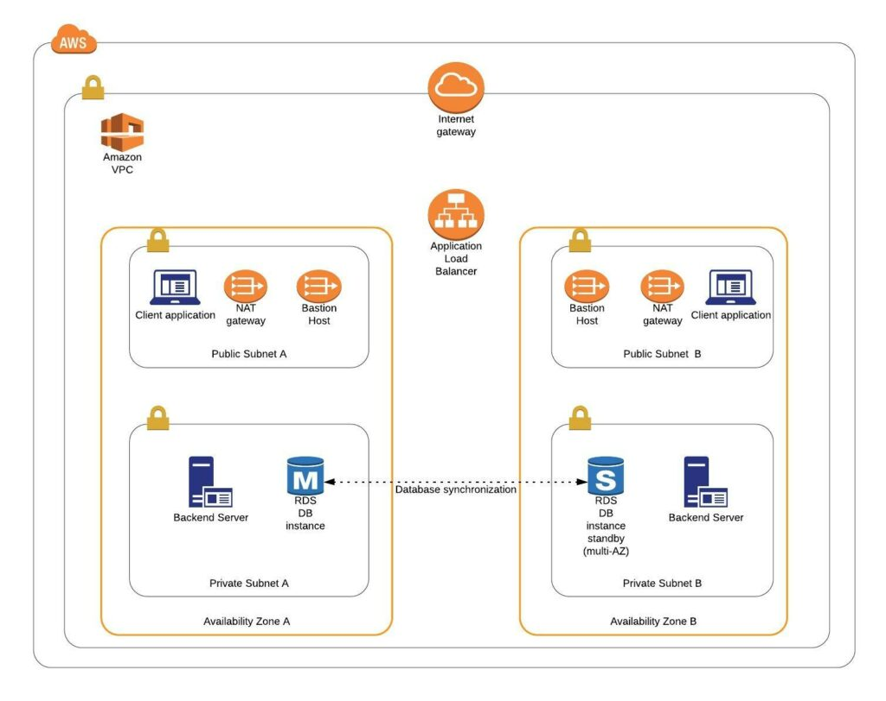
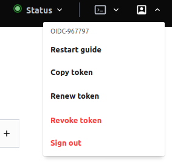
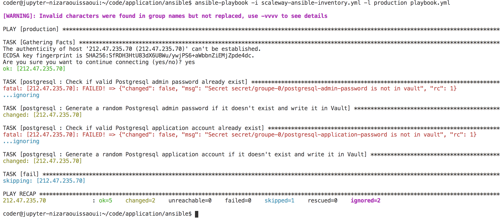
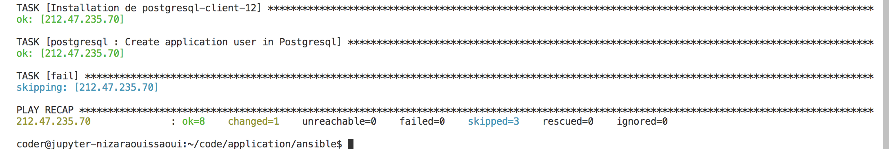

# Déploiement de l'application et sa DB

Nous souhaitons maintenant déployer notre application démo sur notre VM. L'application a besoin d'une base de données Postgresql pour stocker ses données.

Le développeur a mis en place un système simple pour connecter notre application à sa base Postgresql :

```python
# https://github.com/Azure-Samples/flask-postgresql-app/blob/master/app/app.py
database_uri = 'postgresql+psycopg2://{dbuser}:{dbpass}@{dbhost}/{dbname}'.format(
  dbuser=os.environ['DBUSER'],
  dbpass=os.environ['DBPASS'],
  dbhost=os.environ['DBHOST'],
  dbname=os.environ['DBNAME']
)
```

L'application va récupérer les informations de connexion via des variables d'environnement. Comme l'application va être exécutée dans un conteneur Docker, il faudra instancier le conteneur avec ces variables :
- `DBHOST`
- `DBNAME`
- `DBUSER`
- `DBPASS`

> On notera que le développeur n'a pas prévu d'utiliser TLS pour sécuriser la connexion à la base de données. **Dans la vraie vie (en dev comme en production) on mettrait en place TLS pour éviter tout vol de credential BDD.** (Nous n'aurons pas le temps de le faire pendant le TP malheureusement)

Pour simplifier le TP, nous allons déployer Postgresql dans un conteneur Docker (https://hub.docker.com/_/postgres) sur la même machine que l'application, et nous n'activerons pas TLS pour les raisons évoquées ci-dessus.

> Dans la vraie vie, on sépare la BDD de l'application :
  
  

  On voit ici que l'application est dans un réseau accessible depuis Internet en HTTPS (TCP 443), mais que la BDD est dans un réseau privé totalement isolé d'Internet. Cela améliore considérablement la sécurité.

Afin de commencer à sécuriser les credentials de la BDD, nous allons générer 2 credentials à la BDD :
- Un compte admin (root)
- Un compte applicatif avec uniquement les droits RW dans la DB de l'application

Ces comptes seront générés par Ansible afin d'avoir des vrais mots de passe aléatoires (et pas admin/password).

Ils seront stockés dans Vault afin de ne pas les laisser traîner n'importe-où en clair.

Nous améliorerons la gestion des credentials BDD dans le prochain TP.

## Création de 2 credentials BDD dans Ansible avec stockage dans Vault

Afin d'implementer les spécifications ci-dessus, nous allons créer un role Ansible dans le répertoire `ansible/roles` de notre dépôt `application` :

0.  Créez une issue `Create Postgresql DB credentials in Vault` dans le dépôt Gitlab `application`, puis créez la Merge Request et sa branche associée.
1.  Dans Code-Hitema, pullez le code et basculez sur la nouvelle branche.
2.  Créez la structure de répertoires suivante :
    ```bash
    mkdir -p ansible/roles/postgresql
    mkdir ansible/roles/postgresql/tasks
    touch ansible/roles/postgresql/tasks/main.yml
    touch ansible/playbook.yml
    ```
3.  Dans `.gitlab-ci.yml` ajouter un stage `deploy` en dernier.
4.  Ajoutez les jobs suivants dans `.gitlab-ci.yml` à la fin :
    ```yaml
    # Remplacez l'image existante avec la 1.6.0
    image: captnbp/gitlab-ci-image:1.6.0
    
    # A la fin du fichier
    ansible_lint:
      stage: test
      script:
        - cd ${CI_PROJECT_DIR}/ansible
        - ansible-lint .

    deploy_app:
      stage: deploy
      environment:
        name: production
      before_script:
        - export VAULT_TOKEN="$(vault write -field=token auth/jwt/login role=application-groupe-<GROUP_NUMBER> token_ttl=30 jwt=$CI_JOB_JWT)"
        - export SCW_DEFAULT_PROJECT_ID="$(vault kv get -field=SCW_DEFAULT_PROJECT_ID secret/groupe-<GROUP_NUMBER>/scaleway)"
        - export SCW_DEFAULT_ORGANIZATION_ID="$(vault kv get -field=SCW_DEFAULT_PROJECT_ID secret/groupe-<GROUP_NUMBER>/scaleway)"
        - export SCW_ACCESS_KEY="$(vault kv get -field=SCW_ACCESS_KEY secret/groupe-<GROUP_NUMBER>/scaleway)"
        - export SCW_SECRET_KEY="$(vault kv get -field=SCW_SECRET_KEY secret/groupe-<GROUP_NUMBER>/scaleway)"
        - export SCW_DEFAULT_ZONE="$(vault kv get -field=SCW_DEFAULT_ZONE secret/groupe-<GROUP_NUMBER>/scaleway)"
        - export SCW_TOKEN="$(vault kv get -field=SCW_SECRET_KEY secret/groupe-<GROUP_NUMBER>/scaleway)"
      script:
        # Install ssh-agent if not already installed
        - 'which ssh-agent || ( apt-get update -y && apt-get install openssh-client -y )'
        - eval "$(ssh-agent -s)"

        # Création du dossier
        - mkdir -p ~/.ssh
        - chmod 700 ~/.ssh

        - ssh-keygen -t ed25519 -C Gitlab -N "" -f ${HOME}/.ssh/id_ed25519
        - ssh-add ${HOME}/.ssh/id_ed25519

        # Make Vault sign our public key and store the SSH certificate in .ssh/
        - vault write -field=signed_key ssh/sign/gitlab public_key=@${HOME}/.ssh/id_ed25519.pub > ${HOME}/.ssh/id_ed25519-cert.pub
        - ssh-keygen -L -f ${HOME}/.ssh/id_ed25519-cert.pub
      
        # Deploy
        - cd ${CI_PROJECT_DIR}/ansible
        - ls -la
        - ansible-playbook -i scaleway-ansible-inventory.yml -l production playbook.yml --syntax-check -e "image=$CI_REGISTRY_IMAGE:$CI_COMMIT_SHA"
        - ansible-playbook -i scaleway-ansible-inventory.yml -l production playbook.yml -e "image=$CI_REGISTRY_IMAGE:$CI_COMMIT_SHA"
    ```
5.  Crééz le fichier d'[inventaire Ansible dynamique](https://docs.ansible.com/ansible/latest/scenario_guides/guide_scaleway.html#dynamic-inventory-script) suivant `ansible/scaleway-ansible-inventory.yml`:
    ```yaml
    plugin: scaleway
    regions:
      - par1
    ```

    Ce fichier va permettre à Ansible de lister toutes les VMs qui matchent les critères dans le fichier (ici région fr-par) et présenter des groupes de VMs par tag à Ansible
6.  Créez votre Playbook Ansible `ansible/playbook.yml` qui va permettre d'exécuter le role `postgresql` sur la VM remontée par l'inventaire dynamique Ansible.
    Ajoutez en tout premier les lignes suivante pour qu'Ansible sorte en erreur si aucune VM n'est trouvée par l'inventaire dynamique :

    ```yaml
    - hosts: localhost
      tasks:
        - fail:
            msg: "[ERROR] Empty inventory. No host available."
          when: groups.production|length == 0
    ```
7.  Ensuite, ajouter ce qu'il faut :
    - Afin d'être sûr de déployer sur la bonne VM, le playbook devra s'exécuter sur le groupe de `hosts: production`
    - Le remote user devra être `root`
    - Le role à exécuter est `postgresql`
8.  Ouvrez et éditez le fichier `ansible/roles/postgresql/tasks/main.yml` dans code-hitema.
    ```yaml
    - name: Check if valid Postgresql admin password already exist
      hashivault_read:
        secret: "groupe-<group_number>/postgresql-admin-password"
      register: stat_postgresql_admin_password
      ignore_errors: yes
      delegate_to: 127.0.0.1

    - name: Generate a random Postgresql admin password if it doesn't exist and write it in Vault
      hashivault_write:
        secret: "groupe-<group_number>/postgresql-admin-password"
        data:
          username: root
          password: "{{ lookup('password', '/dev/null length=32 chars=ascii_letters,digits') }}"
      when: stat_postgresql_admin_password.failed
      delegate_to: 127.0.0.1

    - name: Check if valid Postgresql application account already exist
      hashivault_read:
        secret: "groupe-<group_number>/postgresql-application-password"
      register: stat_postgresql_application_password
      ignore_errors: yes
      delegate_to: 127.0.0.1

    - name: Generate a random Postgresql application account if it doesn't exist and write it in Vault
      hashivault_write:
        secret: "groupe-<group_number>/postgresql-application-password"
        data:
          username: application
          password: "{{ lookup('password', '/dev/null length=32 chars=ascii_letters,digits') }}"
      when: stat_postgresql_application_password.failed
      delegate_to: 127.0.0.1
    ```
9.  Nous allons maintenant tester notre playbook en CLI depuis le terminal code-hitema:
    - Ouvrez la page https://vault-hitema.doca.cloud/ui/ et récupérez votre `VAULT_TOKEN` :

      
      
    - Créez la variable d'environnement dans le Terminal de Code-Hitema :
      ```bash
      export VAULT_TOKEN=<Le token précédement récupéré>
      ```
    - Exportez les les variables d'environnement nécessaire à l'exécution d'Ansible :
      ```bash
      export SCW_DEFAULT_PROJECT_ID=$(vault read -field=SCW_DEFAULT_PROJECT_ID secret/groupe-${GROUP_NUMBER}/scaleway)
      export SCW_DEFAULT_ORGANIZATION_ID=$(vault read -field=SCW_DEFAULT_ORGANIZATION_ID secret/groupe-${GROUP_NUMBER}/scaleway)
      export SCW_ACCESS_KEY=$(vault read -field=SCW_ACCESS_KEY secret/groupe-${GROUP_NUMBER}/scaleway)
      export SCW_SECRET_KEY=$(vault read -field=SCW_SECRET_KEY secret/groupe-${GROUP_NUMBER}/scaleway)
      export SCW_DEFAULT_ZONE=$(vault read -field=SCW_DEFAULT_ZONE secret/groupe-${GROUP_NUMBER}/scaleway)
      export SCW_TOKEN=$(vault read -field=SCW_SECRET_KEY secret/groupe-${GROUP_NUMBER}/scaleway)
      ```
    - Puis :
      ```bash
      cd ansible/
      vault write -field=signed_key ssh/sign/students public_key=@$HOME/.ssh/id_ed25519.pub > $HOME/.ssh/id_ed25519-cert.pub
      /home/coder/.local/bin/ansible-lint .
      ansible-inventory --list -i scaleway-ansible-inventory.yml
      ansible-playbook -i scaleway-ansible-inventory.yml -l production playbook.yml --syntax-check
      ansible-playbook -i scaleway-ansible-inventory.yml -l production playbook.yml
      ```
      
    - Enfin, vérifiez que les 2 comptes Postgresql sont bien présents dans Vault
10. Si le test manuel est passé, commitez votre code sur la branche et pushez
    ```bash
    git commit .gitlab-ci.yml ansible/playbook.yml ansible/scaleway-ansible-inventory.yml ansible/roles/postgresql/tasks/main.yml -m "Create Postgresql DB credentials in Vault"
    git push
    ```
11. Demandez une revue de code à votre professeur en l'assignant à votre MR dans Gitlab, puis une fois la Merge Request approuvée, mergez la branche et constatez le déploiement de votre playbook.

## Déploiement de la DB Postgresql

> Petit rappel, dans le TP 4 Ansible, nous avons créé une partition data sur le volume bloc (créé dans le TP Terraform) et nous l'avons monté dans `/data`. Nous allons utilisé ce volume bloc persistant et répliqué pour stocker les données de notre BDD.

> Attention, nous n'allons pas implémenter **TLS ni l'audit de sécurité sur la base Postgresql** (pas le temps dans le TP). Dans la vraie vie, c'est indispensable afin de sécuriser le flux de données, mais aussi pour tracer toutes les actions sur la BDD et et détecter des attaques.

0.  Créez une issue `Create Postgresql DB + User from Vault` dans le dépôt Gitlab `application`, puis créez la Merge Request et sa branche associée.
1.  Dans Code-Hitema, pullez le code et basculez sur la nouvelle branche.
2.  A laide des modules Ansible suivants : 
    - [community.general.docker_network](https://docs.ansible.com/ansible/latest/collections/community/general/docker_network_module.html)
    - [community.general.docker_container](https://docs.ansible.com/ansible/latest/collections/community/general/docker_container_module.html)
    
    Ajoutez les tasks suivantes dans `ansible/roles/postgresql/tasks/main.yml` à la suite des tasks pour Vault :
    - Créez le Docker network (type bridge) nommé `db` (on va isoler le réseau virtuel de la DB de celui de la couche web)
    - Deploy postgresql
      ```yaml
      - name: Deploy Postgresql
        community.general.docker_container:
          name: postgres
          state: started
          image: postgres:12
          restart_policy: always
          published_ports:
            - "5432:5432" # A ne pas faire dans la vraie vie !! C'est juste pour simplifier le TP quand on branchera Vault et le monitoring. Dans la vraie vie on mettrait un conteneur dédié au monitoring et un autre pour Vault, réliés au network DB par exemple.
          networks:
            - name: db
          volumes:
            - /data/db:/var/lib/postgresql/data # On monte ici le répertoire /var/lib/postgresql/data du conteneur dans notre volume bloc persistant monté sur la VM
          labels:
            co.elastic.logs/module: postgresql
          env:
            POSTGRES_PASSWORD: "{{ lookup('community.general.hashi_vault', 'secret/groupe-<group_number>/postgresql-admin-password:password auth_method=token') }}"
            POSTGRES_USER: root
        register: postgresql
      ```
4.  On va maintenant créer la DB de notre application et son user/role dans `ansible/roles/postgresql/tasks/main.yml` à la suite des tasks pour le déploiement via Docker :
    ```yaml
    - name: Installation de python3-psycopg2
      apt:
        name: python3-psycopg2
        update_cache: yes
    
    - name: Installation de postgresql-client-12
      apt:
        name: postgresql-client-12
        update_cache: yes

    # Create user with a cleartext password if it does not exist or update its password.
    # The password will be encrypted with SCRAM algorithm (available since PostgreSQL 10)
    - name: Create application user in Postgresql
      community.general.postgresql_user:
        db: postgres
        name: "{{ lookup('community.general.hashi_vault', 'secret/groupe-<group_number>/postgresql-application-password:username auth_method=token') }}"
        password: "{{ lookup('community.general.hashi_vault', 'secret/groupe-<group_number>/postgresql-application-password:password auth_method=token') }}"
        priv: "ALL"
        login_host: localhost
        port: 5432
        login_user: "{{ lookup('community.general.hashi_vault', 'secret/groupe-<group_number>/postgresql-admin-password:username auth_method=token') }}"
        login_password: "{{ lookup('community.general.hashi_vault', 'secret/groupe-<group_number>/postgresql-admin-password:password auth_method=token') }}"
      environment:
        PGOPTIONS: "-c password_encryption=scram-sha-256"
    ```
5.  Nous allons maintenant tester notre playbook en CLI depuis le terminal code-hitema:
    - Ouvrez la page https://vault-hitema.doca.cloud/ui/ et récupérez votre `VAULT_TOKEN` :

      
      
    - Créez la variable d'environnement dans le Terminal de Code-Hitema :
      ```bash
      export VAULT_TOKEN=<Le token précédement récupéré>
      ```
    - Exportez les les variables d'environnement nécessaire à l'exécution d'Ansible :
      ```bash
      export SCW_DEFAULT_PROJECT_ID=$(vault read -field=SCW_DEFAULT_PROJECT_ID secret/groupe-${GROUP_NUMBER}/scaleway)
      export SCW_DEFAULT_ORGANIZATION_ID=$(vault read -field=SCW_DEFAULT_ORGANIZATION_ID secret/groupe-${GROUP_NUMBER}/scaleway)
      export SCW_ACCESS_KEY=$(vault read -field=SCW_ACCESS_KEY secret/groupe-${GROUP_NUMBER}/scaleway)
      export SCW_SECRET_KEY=$(vault read -field=SCW_SECRET_KEY secret/groupe-${GROUP_NUMBER}/scaleway)
      export SCW_DEFAULT_ZONE=$(vault read -field=SCW_DEFAULT_ZONE secret/groupe-${GROUP_NUMBER}/scaleway)
      export SCW_TOKEN=$(vault read -field=SCW_SECRET_KEY secret/groupe-${GROUP_NUMBER}/scaleway)
      ```
    - Puis :
      ```bash
      cd ansible/
      vault write -field=signed_key ssh/sign/students public_key=@$HOME/.ssh/id_ed25519.pub > $HOME/.ssh/id_ed25519-cert.pub
      /home/coder/.local/bin/ansible-lint .
      ansible-inventory --list -i scaleway-ansible-inventory.yml
      ansible-playbook -i scaleway-ansible-inventory.yml -l production playbook.yml --syntax-check
      ansible-playbook -i scaleway-ansible-inventory.yml -l production playbook.yml
      ```
      
    - Enfin, vérifiez que le compte Postgresql fonctionne bien depuis la VM avec la commande `psql -U application -h 127.0.0.1 -W postgres`
6.  Si le test manuel est passé, commitez votre code sur la branche et pushez
    ```bash
    git commit ansible/roles/postgresql/tasks/main.yml -m "Create Postgresql DB and User from Vault"
    git push
    ```
7.  Demandez une revue de code à votre professeur en l'assignant à votre MR dans Gitlab, puis une fois la Merge Request approuvée, mergez la branche et constatez le déploiement de votre playbook.

## Déploiement de l'application

0.  Créez une issue `Deploy App` dans le dépôt Gitlab `application`, puis créez la Merge Request et sa branche associée.
1.  Dans Code-Hitema, pullez le code et basculez sur la nouvelle branche.
2.  Créez la structure de répertoires suivante :
    ```bash
    mkdir -p ansible/roles/application
    mkdir ansible/roles/application/tasks
    touch ansible/roles/application/tasks/main.yml
    ```
3.  Ensuite, ajouter le role `application` dans `ansible/playbook.yml`
4.  Scaleway assigne un nom DNS à chaque VM créée. Il est formé de cette manière : <uuid de la VM>.pub.instances.scw.cloud (https://www.scaleway.com/en/docs/instance-domain-name-change/). L'inventaire dynamique Ansible récupère l'uuid de la VM et le met à disposition dans une variable de type fact. Pour lister l'intégralité des facts, utilisez la commande suivante depuis code-hitema :
    ```bash
    export VAULT_TOKEN=<Le token précédement récupéré>
    export SCW_TOKEN=$(vault read -field=SCW_SECRET_KEY secret/groupe-${GROUP_NUMBER}/scaleway)
    ansible -i scaleway-ansible-inventory.yml -m ansible.builtin.setup production -e ansible_user=root
    ```
    Retrouvez le nom de la variable qui contient l'UUID de votre VM, garder le nom dans un coin, on va s'en servir ci-dessous.
    > Ne pas confondre avec les UUIDs des disques/devices/volumes.
5.  Dans `ansible/roles/application/tasks/main.yml` :
    ```yaml
    - name: Create a network
      community.general.docker_network:
        name: web
        driver: bridge
    
    - name: Log into private registry and force re-authorization
      community.general.docker_login:
        registry_url: "{{ lookup('env', 'CI_REGISTRY') }}"
        username: "{{ lookup('env', 'CI_REGISTRY_USER') }}"
        password: "{{ lookup('env', 'CI_REGISTRY_PASSWORD') }}"
        reauthorize: yes

    - name: Deploy application
      community.general.docker_container:
        name: application
        state: started
        image: "{{ image }}"
        restart_policy: always
        user: root
        networks:
          - name: web
          - name: db
        env:
          DBUSER: "{{ lookup('community.general.hashi_vault', 'secret/groupe-<group_number>/postgresql-admin-password:username auth_method=token') }}"
          DBPASS: "{{ lookup('community.general.hashi_vault', 'secret/groupe-<group_number>/postgresql-admin-password:password auth_method=token') }}"
          DBHOST: postgres
          DBNAME: postgres
        labels:
          traefik.enable: "true"
          ## Scaleway assigne un nom DNS à chaque VM créée. Il est formé de cette manière : <uuid de la VM>.pub.instances.scw.cloud
          # L'inventaire dynamique Ansible récupère l'uuid de la VM et le met à disposition dans la variable (fact) que vous avez trouvé ci-dessus
          # On est donc capables de recomposer le nom DNS unique de la VM à partir de son UUID et de la nomenclature Scaleway.
          # Le but ici est de dire à Traefik de rediriger les requêtes arrivant avec l'url https://{{ nom_de_la_variable_retrouvée }}.pub.instances.scw.cloud vers notre application
          # Et de générer un certificat TLS Let's Encrypt reconnu par nos navigateurs.
          # Vous voyez, c'est pas compliqué les certificats ;-)
          traefik.http.routers.application.rule: "Host(`{{ <nom_de_la_variable_retrouvée> }}.pub.instances.scw.cloud`)"
          traefik.http.routers.application.entrypoints: "websecure"
          traefik.http.routers.application.tls.certresolver: "letsencryptresolver"
          ## Le port utilisé par notre application dans son conteneur est le port 5000
          traefik.http.services.application.loadbalancer.server.port: "5000"
          ## Middlewares
          ## On ajoute des headers HTTP pour améliorer la sécurité de notre application (redirection HTTP->HTTPS, HSTS, Cross site scripting, frames, API navigateur, scan de robots)
          traefik.http.middlewares.application.headers.addvaryheader: "true" 
          traefik.http.middlewares.application.headers.hostsproxyheaders: "X-Forwarded-Host"
          traefik.http.middlewares.application.headers.sslRedirect: "true"
          traefik.http.middlewares.application.headers.sslproxyheaders.X-Forwarded-Proto: "https"
          traefik.http.middlewares.application.headers.stsseconds: "63072000"
          traefik.http.middlewares.application.headers.stsincludesubdomains: "true"
          traefik.http.middlewares.application.headers.stspreload: "true"
          traefik.http.middlewares.application.headers.forcestsheader: "true"
          traefik.http.middlewares.application.headers.framedeny: "true"
          traefik.http.middlewares.application.headers.contenttypenosniff: "true"
          traefik.http.middlewares.application.headers.browserxssfilter: "true"
          traefik.http.middlewares.application.headers.referrerpolicy: "same-origin"
          traefik.http.middlewares.application.headers.featurepolicy: "camera 'none'; geolocation 'none'; microphone 'none'; payment 'none'; usb 'none'; vr 'none';"
          traefik.http.middlewares.application.headers.customresponseheaders.X-Robots-Tag: "none,noarchive,nosnippet,notranslate,noimageindex"
    ```
6.  Il faut maintenant corriger l'image Docker de notre application :
    - Remplacez le contenu du fichier `Dockerfile` avec :
      ```
      FROM python:3.8

      COPY requirements.txt /

      WORKDIR /

      RUN pip3 install -r ./requirements.txt --no-cache-dir

      COPY app/ /app/
      COPY run.sh /usr/local/bin/run.sh

      RUN chmod 755 /usr/local/bin/run.sh

      WORKDIR /app
      RUN useradd -ms /bin/bash python-flask
      USER python-flask

      ENV FLASK_APP=app.py
      CMD /usr/local/bin/run.sh
      ```
    - Créez le fichier `run.sh`
      ```bash
      #!/bin/bash
      /usr/local/bin/flask db upgrade
      /usr/local/bin/flask run -h 0.0.0.0 -p 5000
      ```
    - Supprimez la dépendance `Jinja2==2.9.6` dans `requirements.txt`
    - Faites un git commit + git push sur votre branche pour rebuilder votre image Docker
    - Dès que c'est fait, récupérez le nom complet de votre image Docker. Cela nous servira pour les étapes de test manuel dans Code-Hitema
6.  Nous allons maintenant tester notre playbook en CLI depuis le terminal code-hitema:
    - Ouvrez la page https://vault-hitema.doca.cloud/ui/ et récupérez votre `VAULT_TOKEN` :

      
      
    - Créez la variable d'environnement dans le Terminal de Code-Hitema :
      ```bash
      export VAULT_TOKEN=<Le token précédement récupéré>
      ```
    - Exportez les variables d'environnement nécessaire à l'exécution d'Ansible :
      ```bash
      export CI_REGISTRY_USER="<votre mail Gitlab>"
      export CI_REGISTRY_PASSWORD="<votre personal token Gitlab>"
      ```
    - Exportez les variables d'environnement nécessaire à l'exécution d'Ansible :
      ```bash
      export SCW_DEFAULT_PROJECT_ID=$(vault read -field=SCW_DEFAULT_PROJECT_ID secret/groupe-${GROUP_NUMBER}/scaleway)
      export SCW_DEFAULT_ORGANIZATION_ID=$(vault read -field=SCW_DEFAULT_ORGANIZATION_ID secret/groupe-${GROUP_NUMBER}/scaleway)
      export SCW_ACCESS_KEY=$(vault read -field=SCW_ACCESS_KEY secret/groupe-${GROUP_NUMBER}/scaleway)
      export SCW_SECRET_KEY=$(vault read -field=SCW_SECRET_KEY secret/groupe-${GROUP_NUMBER}/scaleway)
      export SCW_DEFAULT_ZONE=$(vault read -field=SCW_DEFAULT_ZONE secret/groupe-${GROUP_NUMBER}/scaleway)
      export SCW_TOKEN=$(vault read -field=SCW_SECRET_KEY secret/groupe-${GROUP_NUMBER}/scaleway)
      export CI_REGISTRY="registry.gitlab.com"
      ```
    - Puis :
      ```bash
      cd ansible/
      vault write -field=signed_key ssh/sign/students public_key=@$HOME/.ssh/id_ed25519.pub > $HOME/.ssh/id_ed25519-cert.pub
      /home/coder/.local/bin/ansible-lint .
      ansible-inventory --list -i scaleway-ansible-inventory.yml
      ansible-playbook -i scaleway-ansible-inventory.yml -l production playbook.yml --syntax-check -e image=<nom complet de votre image>
      ansible-playbook -i scaleway-ansible-inventory.yml -l production playbook.yml -e image=<nom complet de votre image>
      ```
    - Enfin, vérifiez que l'application est bien accessible à l'adresse `https://<uuid de la VM>.pub.instances.scw.cloud`
7.  Si le test manuel est passé, commitez votre code sur la branche et pushez
    ```bash
    git commit ansible/playbook.yml Dockerfile ansible/roles/postgresql/tasks/main.yml -m "Deploy application"
    git push
    ```
8.  Demandez une revue de code à votre professeur en l'assignant à votre MR dans Gitlab, puis une fois la Merge Request approuvée, mergez la branche et constatez le déploiement de votre playbook.
