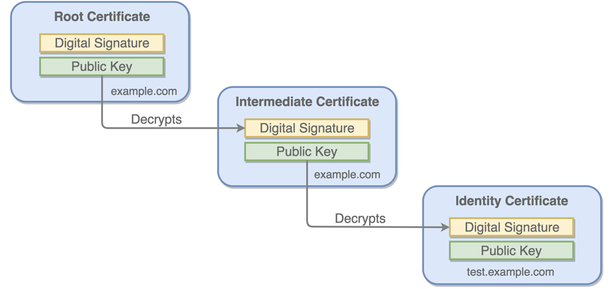

# Intégration de Vault à la BDD Postgresql

## Définition

Vault (par HashiCorp) est un coffre fort permettant de stocker divers secrets, de les restituer, voire de les générer, il peut fournir à des utilisateurs ou à des services tout un tas de secrets – généralement temporaires – comme des certificats, des tokens, des couples login/mot de passe générés dans une instance PostgreSQL ou MongoDB ...

## But

Nous souhaitons faire gérer les comptes de base de données par Vault directement.
Cela veut dire que l'application ou sa mécanique de déploiement vont venir demander un compte temporaire à Vault.
Par défaut, nous allons créer un compte valide 30 jours.

## Architecture


## Fonctionnalités 

*  Gestion des secrets applicatifs: 
   
   
*  Gestion de comptes dynamiques pour les bases de données: 
   
   
*  Rotation du compte root d'une BDD:
   
   
*  PKI TLS / SSL
   
   
*  Authentification SSH aux serveurs:
   
   

## Modes d'authentification

*  Token
   ```bash
   $ vault token create -policy=default -use-limit=2
   
   Key                  Value
   ---                  -----
   token                s.OZZFOsivUeOMeDyFtRz7cOmE
   token_accessor       OOHblEiweXu6ozNUk6GIOl5C
   token_duration       768h
   token_renewable      true
   token_policies       ["default"]
   identity_policies    []
   policies             ["default"]
   
   $ VAULT_TOKEN=s.OZZFOsivUeOMeDyFtRz7cOmE vault token lookup
   
   Key                 Value
   ---                 -----
   accessor            OOHblEiweXu6ozNUk6GIOl5C
   creation_time       1558033998
   creation_ttl        768h
   display_name        token
   entity_id           n/a
   expire_time         2019-06-17T12:13:18.297964-07:00
   explicit_max_ttl    0s
   id                  s.OZZFOsivUeOMeDyFtRz7cOmE
   issue_time          2019-05-16T12:13:18.297963-07:00
   meta                <nil>
   num_uses            1
   ```
*  Kerberos, Radius for humans
*  OIDC / Github / Okta for humans

   
*  LDAP / Active Directory / Radius pour les humains

   
   ```bash
   $ vault login -method=ldap username=mitchellh
   Password (will be hidden):
   Successfully authenticated! The policies that are associated with this token are listed below:
   
   admins
   ```
*  User / Pass pour les humains
   ```bash
   $ vault login -method=userpass username=mitchellh password=foo
   ```
*  Machine / Container identity

   
*  AppRole pour les applications, les batchs (Rundeck), la CI/CD (Jenkins)

   
   
   
*  TLS client certificate pour les applications, les batchs (Rundeck), la CI/CD (Jenkins)

   
*  JWT (Gitlab CI, Domino Datalab, JupyterHub, etc...)

   
*  Cloud service/role identity (AWS, GCP, Azure, etc..)

   

## Documentation

- https://learn.hashicorp.com/vault/secrets-management/sm-dynamic-secrets
- https://www.vaultproject.io/docs/secrets/databases/postgresql.html
- https://github.com/TerryHowe/ansible-modules-hashivault

## Implémentation

### Ouverture du Firewall pour Vault -> Postgresql

Hashicorp Vault est installé sur le même serveur que Mattermost `90.127.9.6`. Il faut lui donner accès à l'instance Postgresql que nous avons déployé sans donner accès à tout Internet afin d'éviter le vol direct de données.

> Dans la vraie vie, on ne fait jamais une ouverture entrante Internet vers une base de données. Vault serait installé dans notre réseau local afin d'éviter ce genre d'ouverture sauvage.

Pour cela nous allons ajouter la règle suivante dans le `scaleway_instance_security_group` que nous avons créé dans Terraform (dépôt `infrastructure`) :

0.  Créez une issue `Allow Vault to access Postgresql` dans le dépôt Gitlab `infrastructure`, puis créez la Merge Request et sa branche associée.
1.  Dans Code-Hitema, pullez le code et basculez sur la nouvelle branche.
2.  Ajoutez les lignes suivantes dans votre `scaleway_instance_security_group` dans `terraform/main.tf` :
    ```hcl
    inbound_rule {
      action    = "accept"
      ip_range  = "90.127.9.6/32"
      protocol  = "TCP"
      port      = 5432
    }
    ```
3. Commitez votre code sur la branche et pushez
   ```bash
   git commit terraform/main.tf -m "Allow Vault to access Postgresql"
   git push
   ```
4. Demandez une revue de code à votre professeur en l'assignant à votre MR dans Gitlab, puis une fois la Merge Request approuvée, mergez la branche et constatez le déploiement de votre playbook.
5. Pensez à bien déployer la règle firewall ajoutée en lançant le job `deploy_app` dans votre pipeline sur la brache `main`
6. Assurez-vous que la règle firewall a bien été déployée pour passer à la suite.

### Configuration de Vault pour manager les utilisateurs de Postgresql

Le but ici est de mettre en place la rotation automatique de credentials pour notre application.

Nous voulons que le compte BDD de l'application expire au bout d'1h et soit recréé automatiquement avec un nouveau mot de passe.
L'intéret est que si unattaquant arrive à récupérer le compte de BDD, il ne pourra l'exploiter que max 1h. Cela limite l'impact de l'attaque.

Passons à l'implémentation :

0.  Créez une issue `Configure Vault to manage Postgresql credentials` dans le dépôt Gitlab `application`, puis créez la Merge Request et sa branche associée.
1.  Dans Code-Hitema, pullez le code et basculez sur la nouvelle branche.
2.  Dans `ansible/roles/postgresql/tasks/main.yml` en pensant à bien remplacer `<group_number>` par votre numéro de groupe :
    - Ajoutez tout en haut du fichier :
      ```yaml
      - name: Check if /data/db exists
        ansible.builtin.stat:
          path: /data/db
        register: data_db
      ```
    - Ajouter la directive suivante à la task "Create application user in Postgresql"
      ```yaml
        when: data_db.stat.isdir is not defined
      ```
    - A la fin du fichier, ajoutez :
    ```yaml
    - name: Forge DB URL
      set_fact:
        db_url: "{{ ansible_product_uuid }}.pub.instances.scw.cloud"
        
    - name: Configure Posgresql database in Vault
      hashivault_write:
        mount_point: database/config/
        secret: postgresql-groupe-<group_number>-prd
        data:
          plugin_name: "postgresql-database-plugin"
          allowed_roles: "application-groupe-<group_number>-prd,monitoring-groupe-<group_number>-prd,backup-groupe-<group_number>-prd"
          username: "{{ lookup('community.general.hashi_vault', 'secret/groupe-<group_number>/postgresql-admin-password:username auth_method=token') }}"
          password: "{{ lookup('community.general.hashi_vault', 'secret/groupe-<group_number>/postgresql-admin-password:password auth_method=token') }}"
          url: "{{ ansible_product_uuid }}.pub.instances.scw.cloud"
          connection_url: "postgresql://{{ '{{' }}username{{ '}}' }}:{{ '{{' }}password{{ '}}' }}@{{ db_url }}:5432/postgres?sslmode=disable"
      delegate_to: 127.0.0.1
      tags:
        - vault_database
        - vault_database_postgresql

    - name: Configure Posgresql monitoring role in Vault
      hashivault_write:
        mount_point: database/roles
        secret: monitoring-groupe-<group_number>-prd
        data:
          db_name: postgresql-groupe-<group_number>-prd
          creation_statements: "CREATE ROLE \"{{ '{{' }}name{{ '}}' }}\" WITH LOGIN PASSWORD '{{ '{{' }}password{{ '}}' }}' VALID UNTIL '{{ '{{' }}expiration{{ '}}' }}'; GRANT SELECT ON pg_stat_database TO \"{{ '{{' }}name{{ '}}' }}\";"
          default_ttl: "768h"
          max_ttl: "87600h"
      delegate_to: 127.0.0.1
      tags:
        - vault_database
        - vault_database_postgresql

    - name: Configure Posgresql backup role in Vault
      hashivault_write:
        mount_point: database/roles
        secret: backup-groupe-<group_number>-prd
        data:
          db_name: postgresql-groupe-<group_number>-prd
          creation_statements: "CREATE ROLE \"{{ '{{' }}name{{ '}}' }}\" WITH LOGIN PASSWORD '{{ '{{' }}password{{ '}}' }}' VALID UNTIL '{{ '{{' }}expiration{{ '}}' }}'; GRANT SELECT ON ALL TABLES IN SCHEMA public TO \"{{ '{{' }}name{{ '}}' }}\"; GRANT USAGE, SELECT ON ALL SEQUENCES IN SCHEMA public TO \"{{ '{{' }}name{{ '}}' }}\";"
          default_ttl: "768h"
          max_ttl: "87600h"
      delegate_to: 127.0.0.1
      tags:
        - vault_database
        - vault_database_postgresql

    - name: Configure Posgresql application role in Vault
      hashivault_write:
        mount_point: database/roles
        secret: application-groupe-<group_number>-prd
        data:
          db_name: postgresql-groupe-<group_number>-prd
          creation_statements: "CREATE ROLE \"{{ '{{' }}name{{ '}}' }}\" WITH LOGIN PASSWORD '{{ '{{' }}password{{ '}}' }}' VALID UNTIL '{{ '{{' }}expiration{{ '}}' }}'; GRANT CONNECT ON DATABASE postgres TO \"{{ '{{' }}name{{ '}}' }}\"; GRANT USAGE ON SCHEMA public TO \"{{ '{{' }}name{{ '}}' }}\"; GRANT ALL PRIVILEGES ON ALL TABLES IN SCHEMA public TO \"{{ '{{' }}name{{ '}}' }}\"; "
          default_ttl: "768h"
          max_ttl: "87600h"
      delegate_to: 127.0.0.1
      tags:
        - vault_database
        - vault_database_postgresql

    - name: Configure policies in Vault
      hashivault_policy:
        name: application-groupe-<group_number>-prd
        rules: |
          # Create a DB user for app
          path "database/creds/application-groupe-<group_number>-prd" {
            capabilities = [ "read", "list" ]
          }

          # List credentials
          path "database/creds/" {
            capabilities = [ "list" ]
          }

          # Revoke creds
          path "sys/leases/revoke/database/creds/application-groupe-<group_number>-prd/+" {
            capabilities = [ "update" ]
          }

          path "secret/groupe-<group_number>/elasticsearch" {
            capabilities = [ "read", "list" ]
          }
      delegate_to: 127.0.0.1
      tags:
        - vault_database
        - vault_database_postgresql
    ```
3.  Nous allons maintenant tester notre playbook en CLI depuis le terminal code-hitema:
    - Ouvrez la page https://vault-hitema.doca.cloud/ui/ et récupérez votre `VAULT_TOKEN` :

      
      
    - Créez la variable d'environnement dans le Terminal de Code-Hitema :
      ```bash
      export VAULT_TOKEN=<Le token précédement récupéré>
      ```
    - Exportez les les variables d'environnement nécessaire à l'exécution d'Ansible :
      ```bash
      export SCW_DEFAULT_PROJECT_ID=$(vault read -field=SCW_DEFAULT_PROJECT_ID secret/groupe-${GROUP_NUMBER}/scaleway)
      export SCW_DEFAULT_ORGANIZATION_ID=$(vault read -field=SCW_DEFAULT_ORGANIZATION_ID secret/groupe-${GROUP_NUMBER}/scaleway)
      export SCW_ACCESS_KEY=$(vault read -field=SCW_ACCESS_KEY secret/groupe-${GROUP_NUMBER}/scaleway)
      export SCW_SECRET_KEY=$(vault read -field=SCW_SECRET_KEY secret/groupe-${GROUP_NUMBER}/scaleway)
      export SCW_DEFAULT_ZONE=$(vault read -field=SCW_DEFAULT_ZONE secret/groupe-${GROUP_NUMBER}/scaleway)
      export SCW_TOKEN=$(vault read -field=SCW_SECRET_KEY secret/groupe-${GROUP_NUMBER}/scaleway)
      ```
    - Puis :
      ```bash
      cd ansible/
      vault write -field=signed_key ssh/sign/students public_key=@$HOME/.ssh/id_ed25519.pub > $HOME/.ssh/id_ed25519-cert.pub
      /home/coder/.local/bin/ansible-lint .
      ansible-inventory --list -i scaleway-ansible-inventory.yml
      ansible-playbook -i scaleway-ansible-inventory.yml -l production playbook.yml --syntax-check -e image=<nom complet de votre image>
      ansible-playbook -i scaleway-ansible-inventory.yml -l production playbook.yml -e image=<nom complet de votre image>
      ```
4. Commitez votre code sur la branche et pushez
   ```bash
   git commit ansible/roles/postgresql/tasks/main.yml -m "Configure Vault to manage Postgresql credentials"
   git push
   ```
5. Demandez une revue de code à votre professeur en l'assignant à votre MR dans Gitlab, puis une fois la Merge Request approuvée, mergez la branche, lancez le job `deploy_app` et constatez le déploiement de votre playbook.

### Déployer l'application en utilisant un compte dynamique Postgresql via Vault

Nous avons donc créé ci-dessus un **role** Vault Database `application-groupe-<group_number>-prd` pour notre application.

Nous allons modifier le déploiement de notre application pour utiliser un compte dynamique généré avec le role `application-groupe-<group_number>-prd`.

Ce compte aura tous les droits dans la base de données `application` afin que l'application puisse auto-créer son schéma SQL, mais aussi lire et écrire dans les tables qu'elle a créées : `GRANT ALL PRIVILEGES ON ALL TABLES IN SCHEMA public TO "application";`

Ansible va donc récupérer un compte temporaire Postgresql au lieu d'utiliser le compte statique que nous avions créé précédement.

Ce setup est temporaire, car le compte expire au bout d'une heure, ce qui va rendre notre application incapable de lire la base de données, et donc non-fonctionnelle. Nous améliorerons ce comportement dans l'étape suivante.

Passons à l'implémentation :

0.  Créez une issue `Configure application to get Postgresql credentials via Vaul dynamic secrets` dans le dépôt Gitlab `application`, puis créez la Merge Request et sa branche associée.
1.  Dans Code-Hitema, pullez le code et basculez sur la nouvelle branche.
2.  Dans `ansible/roles/application/tasks/main.yml` en pensant à bien remplacer `<group_number>` par votre numéro de groupe ajoutez au tout début :
    ```yaml
    - name: Get a dynamic Postgresql account for our application
      set_fact:
        db_account: "{{ lookup('community.general.hashi_vault', 'database/creds/application-groupe-<group_number>-prd auth_method=token') }}"
    ```
3.  Modifiez la task de déploiement de notre application en changeant les 2 variables suivantes :
    ```yaml
          DBUSER: "{{ db_account.username }}"
          DBPASS: "{{ db_account.password }}"
    ```
4.  Nous allons maintenant tester notre playbook en CLI depuis le terminal code-hitema:
    - Ouvrez la page https://vault-hitema.doca.cloud/ui/ et récupérez votre `VAULT_TOKEN` :

      
      
    - Créez la variable d'environnement dans le Terminal de Code-Hitema :
      ```bash
      export VAULT_TOKEN=<Le token précédement récupéré>
      ```
    - Exportez les les variables d'environnement nécessaire à l'exécution d'Ansible :
      ```bash
      export SCW_DEFAULT_PROJECT_ID=$(vault read -field=SCW_DEFAULT_PROJECT_ID secret/groupe-${GROUP_NUMBER}/scaleway)
      export SCW_DEFAULT_ORGANIZATION_ID=$(vault read -field=SCW_DEFAULT_ORGANIZATION_ID secret/groupe-${GROUP_NUMBER}/scaleway)
      export SCW_ACCESS_KEY=$(vault read -field=SCW_ACCESS_KEY secret/groupe-${GROUP_NUMBER}/scaleway)
      export SCW_SECRET_KEY=$(vault read -field=SCW_SECRET_KEY secret/groupe-${GROUP_NUMBER}/scaleway)
      export SCW_DEFAULT_ZONE=$(vault read -field=SCW_DEFAULT_ZONE secret/groupe-${GROUP_NUMBER}/scaleway)
      export SCW_TOKEN=$(vault read -field=SCW_SECRET_KEY secret/groupe-${GROUP_NUMBER}/scaleway)
      ```
    - Puis :
      ```bash
      cd ansible/
      vault write -field=signed_key ssh/sign/students public_key=@$HOME/.ssh/id_ed25519.pub > $HOME/.ssh/id_ed25519-cert.pub
      /home/coder/.local/bin/ansible-lint .
      ansible-inventory --list -i scaleway-ansible-inventory.yml
      ansible-playbook -i scaleway-ansible-inventory.yml -l production playbook.yml --syntax-check -e image=<nom complet de votre image>
      ansible-playbook -i scaleway-ansible-inventory.yml -l production playbook.yml -e image=<nom complet de votre image>
      ```
    - Utilisez votre navigateur pour tester si l'application marche bien
5. Si le test est OK, commitez votre code sur la branche et pushez
   ```bash
   git commit ansible/roles/application/tasks/main.yml -m "Configure application to get Postgresql credentials via Vaul dynamic secrets"
   git push
   ```
6. Demandez une revue de code à votre professeur en l'assignant à votre MR dans Gitlab, puis une fois la Merge Request approuvée, mergez la branche, lancez le job `deploy_app` et constatez le déploiement de votre playbook en vous connectant sur votre application via votre navigateur.

### Intégration de Vault directement dans le code de l'application

Comme vu ci-dessus, ce setup va rien l'application incapable d'utiliser sa BDD au bout d'une heure.

Nous allons améliorer ce comportement en intégrant Vault au code Python de notre application.

Au lieu de recevoir les variables d'environnement Docker `DBUSER` et `DBPASSWORD`, elle recevra un **AppRole** via les variables d'environnement.

Elle utilisera cet Approle une fois lancée pour récupérer et renouveller le compte DB utilisé.

Cela permettra aussi de ne pas exposer le compte DB dans les variables d'environnement et donc de rendre plus difficile la tache à un attaquant.

Passons à l'implémentation :

0.  Créez une issue `Integrate Vault into the Python application` dans le dépôt Gitlab `application`, puis créez la Merge Request et sa branche associée.
1.  Dans Code-Hitema, pullez le code et basculez sur la nouvelle branche.
2.  Dans `ansible/roles/postgresql/tasks/main.yml` en pensant à bien remplacer `<group_number>` par votre numéro de groupe ajoutez à la fin :
    ```yaml
    - name: Create application AppRole
      hashivault_approle_role:
        name: application-groupe-<group_number>-prd
        token_policies:
          - application-groupe-<group_number>-prd
        token_explicit_max_ttl: 768h
        token_ttl: 24h
      delegate_to: 127.0.0.1
    ```
3.  Dans `ansible/roles/application/tasks/main.yml` en pensant à bien remplacer `<group_number>` par votre numéro de groupe ajoutez avant la task `Deploy application` :
    ```yaml
    - name: Get Secret 
      hashivault_approle_role_secret:
        name: application-groupe-<group_number>-prd
      register: secret_id
      delegate_to: 127.0.0.1
    ```
4.  Dans `ansible/roles/application/tasks/main.yml` en pensant à bien remplacer `<group_number>` par votre numéro de groupe :
    - Supprimez les variables `DBUSER` et `DBPASSWORD` de la task `Deploy application`
    - Ajoutez à la place les variables :
      ```yaml
      VAULT_ADDR: "{{ lookup('env', 'VAULT_ADDR') }}"
      VAULT_ROLE_ID: "{{ lookup('community.general.hashi_vault', 'auth/approle/role/application-groupe-<group_number>-prd/role-id:role_id auth_method=token') }}"
      VAULT_SECRET_ID: "{{ secret_id.data.secret_id }}"
      VAULT_DATABASE_ROLE: application-groupe-<group_number>-prd
      ```
5.  Editez le fichier `app/app.py`
    ```python
    import os, hvac

    from flask import Flask, render_template, request
    from flask_migrate import Migrate
    from flask_sqlalchemy import SQLAlchemy

    client = hvac.Client()
    client.auth.approle.login(os.environ['VAULT_ROLE_ID'], secret_id=os.environ['VAULT_SECRET_ID'], use_token=True)
    db_account = client.secrets.database.generate_credentials(os.environ['VAULT_DATABASE_ROLE'])

    database_uri = 'postgresql+psycopg2://{dbuser}:{dbpass}@{dbhost}/{dbname}'.format(
      dbuser=db_account['data']['username'],
      dbpass=db_account['data']['password'],
      dbhost=os.environ['DBHOST'],
      dbname=os.environ['DBNAME']
    )

    app = Flask(__name__)
    app.config.update(
      SQLALCHEMY_DATABASE_URI=database_uri,
      SQLALCHEMY_TRACK_MODIFICATIONS=False,
    )

    # initialize the database connection
    db = SQLAlchemy(app)

    # initialize database migration management
    migrate = Migrate(app, db)


    @app.route('/')
    def view_registered_guests():
      from models import Guest
      guests = Guest.query.all()
      return render_template('guest_list.html', guests=guests)


    @app.route('/register', methods=['GET'])
    def view_registration_form():
      return render_template('guest_registration.html')


    @app.route('/register', methods=['POST'])
    def register_guest():
      from models import Guest
      name = request.form.get('name')
      email = request.form.get('email')

      guest = Guest(name, email)
      db.session.add(guest)
      db.session.commit()

      return render_template(
        'guest_confirmation.html', name=name, email=email)
    ```
6.  Ajoutez le package Python `hvac` dans le fichier `requirements.txt`
7.  Commitez votre code sur la branche et pushez
   ```bash
   git commit Dockerfile requirements.txt app/app.py ansible/roles/postgresql/tasks/main.yml ansible/roles/application/tasks/main.yml -m "Integrate Vault into the Python application"
   git push
   ```
8.  Demandez une revue de code à votre professeur en l'assignant à votre MR dans Gitlab, puis une fois la Merge Request approuvée, mergez la branche, lancez le job `deploy_app` et constatez le déploiement de votre playbook en vous connectant sur votre application via votre navigateur.

