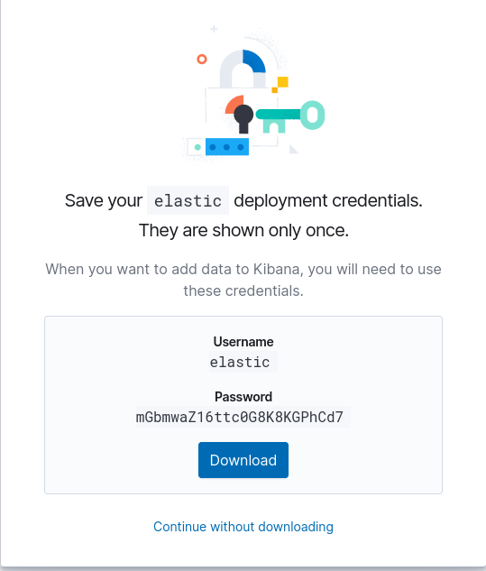
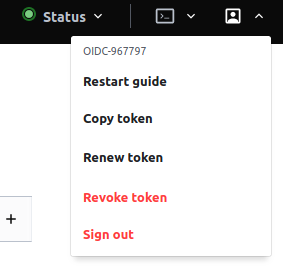

# Monitoring / Observability

Le monitoring et plus globalement l'Observability est composé de plusieurs catégories :

- Métrologie / Métriques (métriques et graphiques) Ex : 
  - CPU
  - RAM
  - Disk
  - Nombres de requêtes par secondes
  - Latence moyenne
  - Nombre d'erreurs
  - Nombre de jours restant avant expiration du certificat
- Logs / événements Ex :
  - Logs système (auth, syslog, kernel, etc)
  - Logs applicatifs
  - Logs d'audit (qui fait quoi à quel moment sur quoi)
  - Evénement (Batch failed)
  - Exceptions
- Status / Health-check
  - URL OK
  - Certificat valide
- APM / Tracing (collecte de toutes les transaction d'une requette)
- Security monitoring / SIEM
- Network monitoring
- RUM Real User monitoring

Voici un petit état du marché des solutions de monitoring :

- Les solutions "legacy" qu'on trouve encore un peu partout mais trop limitées pour les usages actuels :
  - Nagios (Status / Health checks uniquement)
  - Zabbix (Status / Health checks, Metrics)
  - Centreon (Status / Health checks, Metrics)
- Les solutions tout en un :
  - [Datadog](https://www.datadoghq.com/) (SaaS)
  - [Elastic Stack](https://www.elastic.co/fr/observability) (SaaS & On premise)
- Les solutions intégrée Cloud
  - Stack Driver (Google Cloud)
  - Cloud Watch
- Les solutions métriques uniquement :
  - Prometheus stack + Grafana
  - TICK (InfluxDB)
  - Sysdig (SaaS)
- Les solutions logs
  - Elasticsearch + Kibana
  - Splunk
  - Loki + Grafana
  - LogDNA
  - [Datadog](https://www.datadoghq.com/)
- Les solutions APM
  - Dynatrace
  - APPDynamics
  - Jaeger
  - Zipkin
  - Newrelic
  - [Datadog](https://www.datadoghq.com/)
  - Elastic stack
- Les solutions sécurité
  - [Datadog](https://www.datadoghq.com/)
  - [Elastic Stack](https://www.elastic.co/fr/security)
- Les solutions d'alerting (notifications, appel, SMS, planning d'astreintes, escalade)
  - Opsgenie (SaaS)
  - PagerDuty (SaaS)
  - VictorOps (SaaS)

Dans le cadre du TP nous allons utiliser la version SaaS d'Elastic stack : [Elastic Cloud](https://www.elastic.co/fr/cloud/).

Cela nous permettra de couvrir les domaines suivants du monitoring :
- Métriques
  - Système
  - Docker
  - Traefik
  - Postgresql
  - Certificat
  - Latence de notre application
- Status
  - URL de notre application
  - Validité du certificat
- Logs
  - Système
  - Docker
  - Traefik (access logs)
  - Postgresql
  - Application
- APM
  - Traefik
  - Application
- Security / SIEM
  - Système
- Network

Ensuite nous déploierons les agents [Elastic Beats](https://www.elastic.co/fr/beats/) sur notre VM afin de collecter tout ça.

## Création de votre cluster Elastic stack

1.  Créer le compte Elastic Cloud https://www.elastic.co/fr/cloud/
2.  Déployer un cluster Elasticsearch gratuit

    

3.  Récupérer le compte elastic, le cloud id, le token APM et l'url de Kibana

    

    

    

## Stockage des secrets dans Hashicorp Vault
1.  Insérer ces informations dans vault à l'adresse suivante : https://vault-hitema.doca.cloud/ui/ dans un secret JSON nommé `groupe-<group_number>/elasticsearch` sous la forme : 
    ```json
    {
      "apm_token": "<token de votre APM server>",
      "apm_url": "<URL de votre APM>",
      "cloud_id": "<votre cloud id elastic>",
      "es_url": "<URL de votre Elasticsearch>",
      "kibana_url": "<URL de votre Kibana>",
      "password": "<votre mot de passe elastic>",
      "username": "elastic"
    }
    ```

    

## Déploiement des agents de monitoring Elastic Beats

La suite Elastic Stack propose ses agents (beats) de monitoring. Ils sont très légers, ont un impact faible sur les performances de la machine, et font juste ce qu'on leur demande.

Voici les diffiréents beats que nous allons utiliser :

- Auditbeat : collecte les informations d'audit du système, les changements sur les packages système, les changements sur les binaires de l'OS
- Filebeat : collecte des logs système et applicatifs
- Heartbeat : teste si l'application HTTP répond corretement et si les certificats sont valides
- Metricbeat : collecte les métriques du système, de Docker, de Traefik/Postgresql, etc..
- Packetbeat : collecte le trafic réseau pour faire des statistiques ou détecter certaines attaques

Afin de les installer simplement, nous allons utiliser une role Ansible déjà fait, en l'important vian Ansible Galaxy. Cela permet de réutiliser des roles standards à l'entreprise dans tous nos Playbooks.

Nous allons aussi reconfigurer Traefik pour qu'il mette à disposition ses logs dans stdout/stderr du conteneur Docker. Filebeat les collectera pour les envoyer à Elasticsearch.

0.  Dans le dépôt `infrastructure`, créez une issue `Post-config - Deploy Beats monitoring agents`, puis créez la Merge Request et sa branche associée.
1.  Dans Code-Hitema, pullez le code et basculez sur la nouvelle branche.
3.  Ouvrez et éditez le fichier `postconf_vm/roles/traefik/tasks/main.yml` dans code-hitema.
4.  Remplacez la task `Deploy Traefik` par celle ci-dessous en pensant à bien remplacer `<group_number>` par votre numéro de groupe :
    ```yaml
    - name: Deploy Traefik
      community.general.docker_container:
        name: traefik
        state: started
        image: traefik:v2.3
        command:
          - "--providers.docker.endpoint=unix:///var/run/docker.sock"
          - "--providers.docker.exposedbydefault=false"
          - "--api.insecure=true"
          - "--providers.docker=true"
          - "--providers.docker.network=web"
          - "--entrypoints.web.address=:80"
          - "--entrypoints.web.http.redirections.entryPoint.to=websecure"
          - "--entrypoints.web.http.redirections.entryPoint.scheme=https"
          - "--entrypoints.web.http.redirections.entrypoint.permanent=true"
          - "--entrypoints.websecure.address=:443"
          - "--certificatesresolvers.letsencryptresolver.acme.httpchallenge=true"
          - "--certificatesresolvers.letsencryptresolver.acme.httpchallenge.entrypoint=web"
          - "--certificatesresolvers.letsencryptresolver.acme.email={{ lookup('env','GITLAB_USER_EMAIL') }}"
          - "--certificatesresolvers.letsencryptresolver.acme.storage=/letsencrypt/acme.json"
          - "--accesslog=true"
        restart_policy: always
        published_ports:
          - "80:80"
          - "443:443"
        networks:
          - name: web
        volumes:
          - /var/run/docker.sock:/var/run/docker.sock
          # To persist certificates
          - traefik-certificates:/letsencrypt
        labels:
          co.elastic.logs/module: traefik
    ```
5.  Ajoutez le role `ansible-beats-role` à la fin de votre `postconf_vm/playbook.yml`
    ```yaml
    ---
    - hosts: production
      tags: prd
      remote_user: root
      roles: 
        - { role: ansible-beats-role, tags: ['beats'] }
      vars:
        # Vault secret storage
        vault_monitoring_account_path: "groupe-<number>/elasticsearch"
        # If using Elastic Cloud
        elk_auth_type_cloud_id: True
    ...
    ```
6.  Dans `.gitlab-ci.yml`, et dans le job `postconf`, ajoutez la ligne suivante en tant que première commande du script :
    ```yaml
      script:
        - apt-get update -y && apt-get install git -y
        - ansible-galaxy install 'git+https://gitlab.com/captnbp/ansible-beats-role.git'
    ```
7.  Nous allons maintenant tester notre playbook en CLI depuis le terminal code-hitema:
    - Ouvrez la page https://vault-hitema.doca.cloud/ui/ et récupérez votre `VAULT_TOKEN` :

      
     
    - Créez la variable d'environnement dans le Terminal de Code-Hitema :
      ```bash
      export VAULT_TOKEN=<Le token précédement récupéré>
      export GROUPE_NUMBER=<group_number>
      ```
    - Exportez les les variables d'environnement nécessaire à l'exécution d'Ansible :
      ```bash
      export SCW_DEFAULT_PROJECT_ID=$(vault read -field=SCW_DEFAULT_PROJECT_ID secret/groupe-${GROUPE_NUMBER}/scaleway)
      export SCW_DEFAULT_ORGANIZATION_ID=$(vault read -field=SCW_DEFAULT_ORGANIZATION_ID secret/groupe-${GROUPE_NUMBER}/scaleway)
      export SCW_ACCESS_KEY=$(vault read -field=SCW_ACCESS_KEY secret/groupe-${GROUPE_NUMBER}/scaleway)
      export SCW_SECRET_KEY=$(vault read -field=SCW_SECRET_KEY secret/groupe-${GROUPE_NUMBER}/scaleway)
      export SCW_DEFAULT_ZONE=$(vault read -field=SCW_DEFAULT_ZONE secret/groupe-${GROUPE_NUMBER}/scaleway)
      export SCW_TOKEN=$(vault read -field=SCW_SECRET_KEY secret/groupe-${GROUPE_NUMBER}/scaleway)
      ```
    - Puis :
      ```bash
      ansible-galaxy install 'git+https://gitlab.com/captnbp/ansible-beats-role.git'
      cd postconf_vm/
      vault write -field=signed_key ssh/sign/students public_key=@$HOME/.ssh/id_ed25519.pub > $HOME/.ssh/id_ed25519-cert.pub
      /home/coder/.local/bin/ansible-lint .
      ansible-inventory --list -i scaleway-ansible-inventory.yml
      ansible-playbook -i scaleway-ansible-inventory.yml -l production playbook.yml --syntax-check
      ansible-playbook -i scaleway-ansible-inventory.yml -l production playbook.yml
      ```
8.  Si le test manuel est passé, commitez votre code sur la branche et pushez
    ```bash
    git commit .gitlab-ci.yml postconf_vm/playbook.yml postconf_vm/roles/traefik/tasks/main.yml -m "Post-config - Deploy Beats monitoring agents"
    git push
    ```
9.  Demandez une revue de code à votre professeur en l'assignant à votre MR dans Gitlab, puis une fois la Merge Request approuvée, mergez la branche et constatez le déploiement de votre playbook.


## Visualisation du résultat dans Kibana

Connectez-vous à votre instance Kibana (lien dans la console Elastic Cloud) avec le compte `elastic` et essayez:

-  Les différents dashboards
-  L'onglet SIEM
-  L'onglet monitoring
-  Consultez le contenu des indexes dans l'onglet Discovery

## Monitoring de Postgresql

Pour monitorer Postgresql, nous allons collecter :

- Les logs du conteneur Postgresql via Filebeat. Le setup est déjà fait via le label suivant sur le conteneur :
  ```yaml
  labels:
    co.elastic.logs/module: postgresql
  ```
- Les métriques via Metricbeat
  - Doc : https://www.elastic.co/guide/en/beats/metricbeat/current/metricbeat-module-postgresql.html

Passons à l'implémentation dans Metricbeat :

0.  Créez une issue `Monitore Postgresql` dans le dépôt Gitlab `application`, puis créez la Merge Request et sa branche associée.
1.  Dans Code-Hitema, pullez le code et basculez sur la nouvelle branche.
2.  Créez la structure de répertoires suivante :
    ```bash
    mkdir ansible/roles/postgresql/templates
    touch ansible/roles/postgresql/templates/metricbeat.yml.j2
    ```
3.  Ajoutez les tasks suivantes au début de `ansible/roles/postgresql/tasks/main.yml` en pensant à bien remplacer `<group_number>` par votre numéro de groupe :
    ```yaml
    - name: Get a dynamic Postgresql account for our application
      set_fact:
        db_monitoring_account: "{{ lookup('community.general.hashi_vault', 'database/creds/monitoring-groupe-<group_number>-prd auth_method=token') }}"

    - name: Deploy Metricbeat config
      template:
        src: metricbeat.yml.j2
        dest: /etc/metricbeat/modules.d/postgresql.yml
        mode: 0600
        owner: root
        group: root
    ```
4.  Ajouter un fichier `ansible/roles/postgresql/templates/metricbeat.yml.j2` :
    ```yaml
    - module: postgresql
      metricsets:
        - statement
        - database
        - bgwriter
        - activity
      hosts: ["postgres://127.0.0.1:5432/postgres?sslmode=disable"]
      username: "{{ db_monitoring_account.username }}"
      password: "{{ db_monitoring_account.password }}"
    ```
5.  Nous allons maintenant tester notre playbook en CLI depuis le terminal code-hitema:
    - Ouvrez la page https://vault-hitema.doca.cloud/ui/ et récupérez votre `VAULT_TOKEN` :

      
     
    - Créez la variable d'environnement dans le Terminal de Code-Hitema :
      ```bash
      export VAULT_TOKEN=<Le token précédement récupéré>
      export GROUPE_NUMBER=<group_number>
      ```
    - Exportez les les variables d'environnement nécessaire à l'exécution d'Ansible :
      ```bash
      export SCW_DEFAULT_PROJECT_ID=$(vault read -field=SCW_DEFAULT_PROJECT_ID secret/groupe-${GROUPE_NUMBER}/scaleway)
      export SCW_DEFAULT_ORGANIZATION_ID=$(vault read -field=SCW_DEFAULT_ORGANIZATION_ID secret/groupe-${GROUPE_NUMBER}/scaleway)
      export SCW_ACCESS_KEY=$(vault read -field=SCW_ACCESS_KEY secret/groupe-${GROUPE_NUMBER}/scaleway)
      export SCW_SECRET_KEY=$(vault read -field=SCW_SECRET_KEY secret/groupe-${GROUPE_NUMBER}/scaleway)
      export SCW_DEFAULT_ZONE=$(vault read -field=SCW_DEFAULT_ZONE secret/groupe-${GROUPE_NUMBER}/scaleway)
      export SCW_TOKEN=$(vault read -field=SCW_SECRET_KEY secret/groupe-${GROUPE_NUMBER}/scaleway)
      ```
    - Puis :
      ```bash
      ansible-galaxy install 'git+https://gitlab.com/captnbp/ansible-beats-role.git'
      cd ansible/
      vault write -field=signed_key ssh/sign/students public_key=@$HOME/.ssh/id_ed25519.pub > $HOME/.ssh/id_ed25519-cert.pub
      /home/coder/.local/bin/ansible-lint .
      ansible-inventory --list -i scaleway-ansible-inventory.yml
      ansible-playbook -i scaleway-ansible-inventory.yml -l production playbook.yml --syntax-check
      ansible-playbook -i scaleway-ansible-inventory.yml -l production playbook.yml -e image=<nom complet de votre image>
      ```
6.  Connectez vous sur votre VM, et lancer les quatre commandes suivantes :
    ```bash
    metricbeat setup
    filebeat setup
    filebeat setup --machine-learning --dashboards
    auditbeat setup
    heartbeat setup
    ```
7.  Allez dans Kibana, cherchez les dashboard pour Postgresql et vérifiez que vous avez bien des remontées de métriques
    
8.  Si le test manuel est passé, commitez votre code sur la branche et pushez
    ```bash
    git add ansible/roles/postgresql/templates/metricbeat.yml.j2
    git commit ansible/roles/postgresql/templates/metricbeat.yml.j2 ansible/roles/postgresql/tasks/main.yml -m "Monitore Postgresql"
    git push
    ```
9.  Demandez une revue de code à votre professeur en l'assignant à votre MR dans Gitlab, puis une fois la Merge Request approuvée, mergez la branche et constatez le déploiement de votre playbook.

## APM

Afin de mettre en place l'APM, nous allons brancher les composants ci-dessous à Elastic APM :

- Traefik
- Application demo Python

Traefik nous facilite la vie car il y a juste des options à rajouter dans la commande du conteneur.

Pour l'application, Elastic fournit une librairie Python pour Flask.

### Traefik tracing

Doc : https://doc.traefik.io/traefik/observability/tracing/elastic/

0.  Dans le dépôt `infrastructure`, créez une issue `Post-config - Deploy Beats monitoring agents`, puis créez la Merge Request et sa branche associée.
1.  Dans Code-Hitema, pullez le code et basculez sur la nouvelle branche.
3.  Ouvrez et éditez le fichier `postconf_vm/roles/traefik/tasks/main.yml` dans code-hitema.
4.  Remplacez la task `Deploy Traefik` par celle ci-dessous en pensant à bien remplacer `<group_number>` par votre numéro de groupe :
    ```yaml
    - name: Deploy Traefik
      community.general.docker_container:
        name: traefik
        state: started
        image: traefik:v2.3
        command:
          - "--providers.docker.endpoint=unix:///var/run/docker.sock"
          - "--providers.docker.exposedbydefault=false"
          - "--api.insecure=true"
          - "--providers.docker=true"
          - "--providers.docker.network=web"
          - "--entrypoints.web.address=:80"
          - "--entrypoints.web.http.redirections.entryPoint.to=websecure"
          - "--entrypoints.web.http.redirections.entryPoint.scheme=https"
          - "--entrypoints.web.http.redirections.entrypoint.permanent=true"
          - "--entrypoints.websecure.address=:443"
          - "--certificatesresolvers.letsencryptresolver.acme.httpchallenge=true"
          - "--certificatesresolvers.letsencryptresolver.acme.httpchallenge.entrypoint=web"
          - "--certificatesresolvers.letsencryptresolver.acme.email={{ lookup('env','GITLAB_USER_EMAIL') }}"
          - "--certificatesresolvers.letsencryptresolver.acme.storage=/letsencrypt/acme.json"
          - "--accesslog=true"
          - "--tracing.elastic=true"
          - "--tracing.elastic.serverurl=\"{{ lookup('community.general.hashi_vault', 'secret/groupe-<group_number>/elasticsearch:apm_url auth_method=token') }}\""
          - "--tracing.elastic.secrettoken=\"{{ lookup('community.general.hashi_vault', 'secret/groupe-<group_number>/elasticsearch:apm_token auth_method=token') }}\""
          - "--tracing.elastic.serviceenvironment=\"production\""
        restart_policy: always
        published_ports:
          - "80:80"
          - "443:443"
        networks:
          - name: web
        volumes:
          - /var/run/docker.sock:/var/run/docker.sock
          # To persist certificates
          - traefik-certificates:/letsencrypt
        labels:
          co.elastic.logs/module: traefik
    ```
6.  Nous allons maintenant tester notre playbook en CLI depuis le terminal code-hitema:
    - Ouvrez la page https://vault-hitema.doca.cloud/ui/ et récupérez votre `VAULT_TOKEN` :

      
     
    - Créez la variable d'environnement dans le Terminal de Code-Hitema :
      ```bash
      export VAULT_TOKEN=<Le token précédement récupéré>
      export GROUPE_NUMBER=<group_number>
      ```
    - Exportez les les variables d'environnement nécessaire à l'exécution d'Ansible :
      ```bash
      export SCW_DEFAULT_PROJECT_ID=$(vault read -field=SCW_DEFAULT_PROJECT_ID secret/groupe-${GROUPE_NUMBER}/scaleway)
      export SCW_DEFAULT_ORGANIZATION_ID=$(vault read -field=SCW_DEFAULT_ORGANIZATION_ID secret/groupe-${GROUPE_NUMBER}/scaleway)
      export SCW_ACCESS_KEY=$(vault read -field=SCW_ACCESS_KEY secret/groupe-${GROUPE_NUMBER}/scaleway)
      export SCW_SECRET_KEY=$(vault read -field=SCW_SECRET_KEY secret/groupe-${GROUPE_NUMBER}/scaleway)
      export SCW_DEFAULT_ZONE=$(vault read -field=SCW_DEFAULT_ZONE secret/groupe-${GROUPE_NUMBER}/scaleway)
      export SCW_TOKEN=$(vault read -field=SCW_SECRET_KEY secret/groupe-${GROUPE_NUMBER}/scaleway)
      ```
    - Puis :
      ```bash
      ansible-galaxy install 'git+https://gitlab.com/captnbp/ansible-beats-role.git'
      cd postconf_vm/
      vault write -field=signed_key ssh/sign/students public_key=@$HOME/.ssh/id_ed25519.pub > $HOME/.ssh/id_ed25519-cert.pub
      /home/coder/.local/bin/ansible-lint .
      ansible-inventory --list -i scaleway-ansible-inventory.yml
      ansible-playbook -i scaleway-ansible-inventory.yml -l production playbook.yml --syntax-check
      ansible-playbook -i scaleway-ansible-inventory.yml -l production playbook.yml
      ```
7.  Si le test manuel est passé, commitez votre code sur la branche et pushez
    ```bash
    git commit .gitlab-ci.yml postconf_vm/playbook.yml postconf_vm/roles/traefik/tasks/main.yml -m "Setup Traefik"
    git push
    ```
8.  Demandez une revue de code à votre professeur en l'assignant à votre MR dans Gitlab, puis une fois la Merge Request approuvée, mergez la branche et constatez le déploiement de votre playbook.

### Application tracing

Doc :
- https://www.elastic.co/guide/en/apm/agent/python/current/flask-support.html
- https://pypi.org/project/elastic-apm/

Implémentation :

0.  Créez une issue `Add APM to application` dans le dépôt Gitlab `application`, puis créez la Merge Request et sa branche associée.
1.  Dans Code-Hitema, pullez le code et basculez sur la nouvelle branche.
2.  Ajoutez les packages Python dans `requirements.txt` : `elastic-apm[flask]` et `blinker`
3.  Ajoutez dans la task `Deploy application` de `ansible/roles/application/tasks/main.yml` en pensant à bien remplacer `<group_number>` par votre numéro de groupe les variables d'environnement suivantes :
    ```yaml
    APM_SECRET_PATH: "groupe-<group_number>/elasticsearch"
    APM_SERVICE_NAME: production
    ```

4.  Dans `app/app.py`, remplacez :
    ```python
    import os, hvac, pprint

    from flask import Flask, render_template, request
    from flask_migrate import Migrate
    from flask_sqlalchemy import SQLAlchemy
    from elasticapm.contrib.flask import ElasticAPM

    client = hvac.Client()
    client.auth.approle.login(os.environ['VAULT_ROLE_ID'], secret_id=os.environ['VAULT_SECRET_ID'])
    client.is_authenticated()
    db_account = client.secrets.database.generate_credentials(os.environ['VAULT_DATABASE_ROLE'])

    database_uri = 'postgresql+psycopg2://{dbuser}:{dbpass}@{dbhost}/{dbname}'.format(
      dbuser=db_account['data']['username'],
      dbpass=db_account['data']['password'],
      dbhost=os.environ['DBHOST'],
      dbname=os.environ['DBNAME']
    )

    app = Flask(__name__)
    apm = ElasticAPM(app)
    app.config.update(
        SQLALCHEMY_DATABASE_URI=database_uri,
        SQLALCHEMY_TRACK_MODIFICATIONS=False,
    )
    client.kv.default_kv_version = 1
    apm_account = client.kv.read_secret(path=os.environ['APM_SECRET_PATH']) 

    app.config['ELASTIC_APM'] = {
      # Set required service name. Allowed characters:
      # a-z, A-Z, 0-9, -, _, and space
      'SERVICE_NAME': os.environ['APM_SERVICE_NAME'],

      # Use if APM Server requires a token
      'SECRET_TOKEN': apm_account['data']['apm_token'],

      # Set custom APM Server URL (default: http://localhost:8200)
      'SERVER_URL': apm_account['data']['apm_url'],
    }

    apm = ElasticAPM(app)

    # initialize the database connection
    db = SQLAlchemy(app)

    # initialize database migration management
    migrate = Migrate(app, db)


    @app.route('/')
    def view_registered_guests():
        from models import Guest
        guests = Guest.query.all()
        return render_template('guest_list.html', guests=guests)


    @app.route('/register', methods=['GET'])
    def view_registration_form():
        return render_template('guest_registration.html')


    @app.route('/register', methods=['POST'])
    def register_guest():
        from models import Guest
        name = request.form.get('name')
        email = request.form.get('email')

        guest = Guest(name, email)
        db.session.add(guest)
        db.session.commit()

        return render_template(
            'guest_confirmation.html', name=name, email=email)
    ```
5.  Nous allons maintenant tester notre playbook en CLI depuis le terminal code-hitema:
    - Ouvrez la page https://vault-hitema.doca.cloud/ui/ et récupérez votre `VAULT_TOKEN` :

      
     
    - Créez la variable d'environnement dans le Terminal de Code-Hitema :
      ```bash
      export VAULT_TOKEN=<Le token précédement récupéré>
      export GROUPE_NUMBER=<group_number>
      ```
    - Exportez les les variables d'environnement nécessaire à l'exécution d'Ansible :
      ```bash
      export SCW_DEFAULT_PROJECT_ID=$(vault read -field=SCW_DEFAULT_PROJECT_ID secret/groupe-${GROUPE_NUMBER}/scaleway)
      export SCW_DEFAULT_ORGANIZATION_ID=$(vault read -field=SCW_DEFAULT_ORGANIZATION_ID secret/groupe-${GROUPE_NUMBER}/scaleway)
      export SCW_ACCESS_KEY=$(vault read -field=SCW_ACCESS_KEY secret/groupe-${GROUPE_NUMBER}/scaleway)
      export SCW_SECRET_KEY=$(vault read -field=SCW_SECRET_KEY secret/groupe-${GROUPE_NUMBER}/scaleway)
      export SCW_DEFAULT_ZONE=$(vault read -field=SCW_DEFAULT_ZONE secret/groupe-${GROUPE_NUMBER}/scaleway)
      export SCW_TOKEN=$(vault read -field=SCW_SECRET_KEY secret/groupe-${GROUPE_NUMBER}/scaleway)
      ```
    - Puis :
      ```bash
      ansible-galaxy install 'git+https://gitlab.com/captnbp/ansible-beats-role.git'
      cd ansible/
      vault write -field=signed_key ssh/sign/students public_key=@$HOME/.ssh/id_ed25519.pub > $HOME/.ssh/id_ed25519-cert.pub
      /home/coder/.local/bin/ansible-lint .
      ansible-inventory --list -i scaleway-ansible-inventory.yml
      ansible-playbook -i scaleway-ansible-inventory.yml -l production playbook.yml --syntax-check
      ansible-playbook -i scaleway-ansible-inventory.yml -l production playbook.yml -e image=<nom complet de votre image>
      ```
7.  Si le test manuel est passé, commitez votre code sur la branche et pushez
    ```bash
    git commit app/app.py requirements.txt ansible/roles/application/tasks/main.yml -m "Add APM to application"
    git push
    ```
8.  Assuez-vous que le job Gitlab CI `deploy_app` s'est bien exécuté.
9.  Rendez vous sur l'url de votre application et tentez de rajouter un guest. Normalement vous devriez avoir une erreur 500. On va investiguer dans l'onglet APM de Kibana.
10. Rendez-vous dans l'onglet `APM` de Kibana, et cherchez la transaction qui a échouée. Cherchez l'erreur.
    
    
11. Donnez l'erreur à votre professeur.
12. Demandez une revue de code à votre professeur en l'assignant à votre MR dans Gitlab, puis une fois la Merge Request approuvée, mergez la branche et constatez le déploiement de votre playbook.

## Monitoring de l'URL et du certificat de notre application

Heartbeat https://www.elastic.co/guide/en/beats/heartbeat/current/monitor-http-options.html

L'agent Hearbeat est configuré pour détecter les URLs HTTPS à monitorer en lisant les labels des conteneurs Docker que nous déployons.
Cf. https://gitlab.com/captnbp/ansible-beats-role/-/blob/master/templates/heartbeat.yml.j2#L23

Nous allons donc ajouter les labels manquants à notre application :

0.  Créez une issue `Monitore our application URL` dans le dépôt Gitlab `application`, puis créez la Merge Request et sa branche associée.
1.  Dans Code-Hitema, pullez le code et basculez sur la nouvelle branche.
2.  Ajoutez les labels suivants au conteneur de notre application dans `ansible/roles/application/tasks/main.yml` dans la task `Deploy application`
    ```yaml
        labels:
          co.elastic.monitor/type: http
          co.elastic.monitor/hosts: "https://{{ ansible_product_uuid }}.pub.instances.scw.cloud:443"
          co.elastic.monitor/schedule: "@every 5s"
    ```
    > Ce mode de configuration est actuellement bugué : https://github.com/elastic/beats/issues/17771 On va donc contourner ci-dessous
3.  Ajoutez le fichier `ansible/roles/application/templates/hearbeat.yml.j2`
    ```yaml
    # These files contain a list of monitor configurations identical
    # to the heartbeat.monitors section in heartbeat.yml
    # The .example extension on this file must be removed for it to
    # be loaded.

    - type: http # monitor type `http`. Connect via HTTP an optionally verify response

      # Monitor name used for job name and document type
      name: application

      # Enable/Disable monitor
      enabled: true

      # Configure task schedule
      schedule: '@every 5s' # every 5 seconds from start of beat

      # Configure URLs to ping
      urls: ["https://{{ ansible_product_uuid }}.pub.instances.scw.cloud:443"]

      ipv4: true

      # Optional HTTP proxy url.
      #proxy_url: ''

      # Total test connection and data exchange timeout
      #timeout: 16s

      # Optional Authentication Credentials
      #username: ''
      #password: ''

      # TLS/SSL connection settings for use with HTTPS endpoint. If not configured
      # system defaults will be used.
      #ssl:
      # Certificate Authorities
      #certificate_authorities: ['']

      # Required TLS protocols
      supported_protocols: ["TLSv1.3"]

      # Request settings:
      #check.request:
      # Configure HTTP method to use. Only 'HEAD', 'GET' and 'POST' methods are allowed.
      method: "GET"

      # Dictionary of additional HTTP headers to send:
      #headers:

      # Optional request body content
      #body:

      # Expected response settings
      #check.response:
        # Expected status code. If not configured or set to 0 any status code not
        # being 404 is accepted.
        #status: 401

        # Required response headers.
        #headers:

        # Required response contents.
        #body:

        # Parses the body as JSON, then checks against the given condition expression
        #json:
        #- description: Explanation of what the check does
        #  condition:
        #    equals:
        #      myField: expectedValue

      # The tags of the monitors are included in their own field with each
      # transaction published. Tags make it easy to group servers by different
      # logical properties.
      #tags: ["service-X", "web-tier"]

      # Optional fields that you can specify to add additional information to the
      # monitor output. Fields can be scalar values, arrays, dictionaries, or any nested
      # combination of these.
      #fields:
      #  env: staging

      # If this option is set to true, the custom fields are stored as top-level
      # fields in the output document instead of being grouped under a fields
      # sub-dictionary. Default is false.
      #fields_under_root: false
    ```
4.  Ajoutez la task suivante à la fin de `ansible/roles/application/tasks/main.yml`:
    ```yaml
    - name: Set URL Monitoring
      ansible.builtin.template:
        src: heartbeat.yml.j2
        dest: /etc/hearbeat/monitors.d/application.yml
        owner: root
        group: root
        mode: '0644'
    ```
5.  Nous allons maintenant tester notre playbook en CLI depuis le terminal code-hitema:
    - Ouvrez la page https://vault-hitema.doca.cloud/ui/ et récupérez votre `VAULT_TOKEN` :

      
     
    - Créez la variable d'environnement dans le Terminal de Code-Hitema :
      ```bash
      export VAULT_TOKEN=<Le token précédement récupéré>
      export GROUPE_NUMBER=<group_number>
      ```
    - Exportez les les variables d'environnement nécessaire à l'exécution d'Ansible :
      ```bash
      export SCW_DEFAULT_PROJECT_ID=$(vault read -field=SCW_DEFAULT_PROJECT_ID secret/groupe-${GROUPE_NUMBER}/scaleway)
      export SCW_DEFAULT_ORGANIZATION_ID=$(vault read -field=SCW_DEFAULT_ORGANIZATION_ID secret/groupe-${GROUPE_NUMBER}/scaleway)
      export SCW_ACCESS_KEY=$(vault read -field=SCW_ACCESS_KEY secret/groupe-${GROUPE_NUMBER}/scaleway)
      export SCW_SECRET_KEY=$(vault read -field=SCW_SECRET_KEY secret/groupe-${GROUPE_NUMBER}/scaleway)
      export SCW_DEFAULT_ZONE=$(vault read -field=SCW_DEFAULT_ZONE secret/groupe-${GROUPE_NUMBER}/scaleway)
      export SCW_TOKEN=$(vault read -field=SCW_SECRET_KEY secret/groupe-${GROUPE_NUMBER}/scaleway)
      ```
    - Puis :
      ```bash
      ansible-galaxy install 'git+https://gitlab.com/captnbp/ansible-beats-role.git'
      cd ansible/
      vault write -field=signed_key ssh/sign/students public_key=@$HOME/.ssh/id_ed25519.pub > $HOME/.ssh/id_ed25519-cert.pub
      /home/coder/.local/bin/ansible-lint .
      ansible-inventory --list -i scaleway-ansible-inventory.yml
      ansible-playbook -i scaleway-ansible-inventory.yml -l production playbook.yml --syntax-check
      ansible-playbook -i scaleway-ansible-inventory.yml -l production playbook.yml -e image=<nom complet de votre image>
      ```
6.  Rendez-vous dans l'onglet `Uptime` de Kibana afin de retrouver votre check HTTP. Vous pourrez y voir le status mais aussi la validité du certificat TLS que Traefik a généré et fait signer pour notre application :
    
    
7.  Si le test manuel est passé, commitez votre code sur la branche et pushez
    ```bash
    git add ansible/roles/application/templates/hearbeat.yml.j2
    git commit ansible/roles/application/templates/hearbeat.yml.j2 ansible/roles/application/tasks/main.yml -m "Monitore our application URL"
    git push
    ```
7.  Demandez une revue de code à votre professeur en l'assignant à votre MR dans Gitlab, puis une fois la Merge Request approuvée, mergez la branche et constatez le déploiement de votre playbook.
