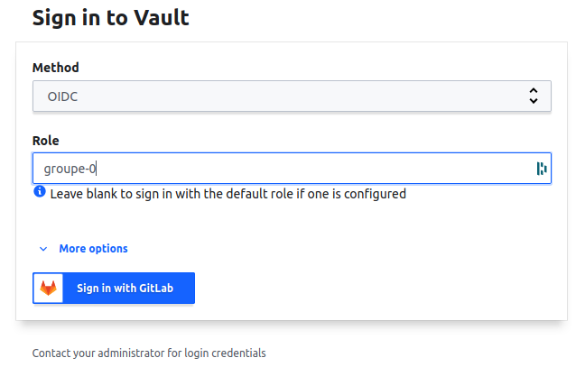

## Backup et restoration de notre application
Nous voulons backuper automatiquement toutes les nuits notre BDD Postgresql et stocker le fichier du dump de la BDD dans un stockage objet de type S3 sur Scaleway.

Voici la doc de l'object storage Scaleway : https://www.scaleway.com/en/docs/object-storage-feature/
Et la fiche produit avec le tarif : https://www.scaleway.com/en/object-storage/

Le job de backup devra utiliser un compte temporaire d'accès à la BDD : `backup-groupe-<group_number>-prd`

Nous avons créé cette configuration de compte dynamique de backup dans le TP 7-Vault.

> **Attention : ce TP va être un peu moins guidé que les TPs précédents ! Mais rassurez vous, sur un malentendu, ça va passer ;-)**

N'ayant pas pu faire fonctionner correctement l'orchestrateur Rundeck, nous allons utiliser un outil que nous connaissons déjà ! **Gitlab CI**.

Gitlab CI permet de scheduller des jobs comme un cron : https://docs.gitlab.com/ee/ci/pipelines/schedules.html

Nous voulons aussi que le backup de la BDD se fasse à chaque déploiement de notre application depuis la branche `master` afin d'avoir un backup frais avant chaque upgrade de l'application. En cas de problème on pourrait revenir en arrière facilement avec peu de perte de données.

Nous voulons aussi pouvoir restorer la BDD. Mais uniquement via un `trigger` Gitlab CI : https://docs.gitlab.com/ee/ci/triggers/

## Implémentation

### Création du bucket S3 Scaleway via Terraform

0.  Créez une issue `Create S3 bucket` dans le dépôt Gitlab `infrastructure`, puis créez la Merge Request et sa branche associée.
1.  Dans Code-Hitema, pullez le code et basculez sur la nouvelle branche.
2.  Dans `terraform/main.tf` ajoutez la ressource suivante :
    - type : scaleway_object_bucket (https://registry.terraform.io/providers/scaleway/scaleway/latest/docs/resources/object_bucket)
    - name: var.environnement
    - acl: private
3.  Demandez une revue de code à votre professeur en l'assignant à votre MR dans Gitlab, puis une fois la Merge Request approuvée, mergez la branche et constatez le déploiement de votre playbook.

### Création d'un nouveau jeu d'access/secret key Scaleway pour le bucket S3

0.  Se rendre sur la page https://console.scaleway.com/
1.  Sélectionner dans la liste des projects votre groupe

    
2.  Clicker sur `Generate new API Key`
3.  **Dans le champ `API Key purpose`, mettre `groupe_<group_number>_s3_backup`**
4.  Ne fermez pas le popup avec les credentials avant d'avoir passé l'étape suivante
5.  Connectez-vous à https://vault-hitema.doca.cloud/ui/vault/secrets/secret/list (Method = `OIDC`, Role = `groupe-<group_number>`)
     
     
6.  Créez un nouveau secret ayant comme path `groupe-<group_number>/scaleway_s3_backup` et ajoutez les variables suivantes :
    - **SCW_ACCESS_KEY** : Votre Access key Scaleway
    - **SCW_SECRET_KEY** : Votre Secret key Scaleway
    - **SCW_DEFAULT_ZONE** : fr-par-1
    - **SCW_DEFAULT_REGION** : fr-par
    - **SCW_S3_URL** : https://s3.fr-par.scw.cloud
7.  Créez une passphrase de chriffrement/déchiffrement symétrique pour chiffre le backup depuis votre terminal code-hitema :
    ```bash
    vault kv put secret/groupe-${GROUPE_NUMBER}/passphrase_s3_backup passphrase=$(pwgen 64 1)
    ```

### Création du scheduled job dans Gitlab CI

0.  Créez une issue `Schedule a backup job for our App DB` dans le dépôt Gitlab `application`, puis créez la Merge Request et sa branche associée.
1.  Dans Code-Hitema, pullez le code et basculez sur la nouvelle branche.
2.  Dans `.gitlab-ci.yml` ajoutez à chaque job déjà existant l'exception suivante :
    ```yaml
    except:
      - schedules
    ```
3.  Ajoutez un stage `backup` avant le stage `deploy` dans `.gitlab-ci.yml`
3.  Créez un nouveau job à la fin du fichier :
    ```yaml
    backup_db:on-schedule:
      stage: backup
      image: captnbp/gitlab-ci-image:v2.9.10
      only:
        - schedules
        - master
      script:
        - export DB_ACCOUNT=$(vault read -format=json database/creds/backup-groupe-<group_number>-prd)
        - export PGPASSWORD=$(echo $DB_ACCOUNT | jq .data.password  | cut -d '"' -f2)
        - export ENCRYPTION_KEY=$(vault read -field=passphrase secret/groupe-<group_number>/passphrase_s3_backup)
        - export S3_CREDENTIALS=$(vault read -format=json secret/groupe-<group_number>/scaleway_s3_backup)
        - <le reste de votre script !>
        - ...
    ```
4.  Complétez le script en vous aidant des outils suivants (au choix):

    - `pg_dump`
    - `mc` / `restic` (https://www.scaleway.com/en/docs/how-to-migrate-object-storage-buckets-with-minio/#-Configuring-the-Minio-Client-and-Migrating-Data) et (https://restic.net/)

    Pour :

    - Faire le dump des tables de la BDD `postgres` de notre applications uniquement
    - Compresser le dump avec `gzip` (Ex. `pg_dump base_de_donnees options | gzip > nom_fichier.gz`)
    - Nommez le fichier avec la date et l'heure courante
    - Chiffrez le fichier et pushez-le dans le bucket S3 avec au choix:
      - `gpg --passphrase ${ENCRYPTION_KEY}` + Minio Client `mc`
      - `restic` (methode préférée car restic sait gérer la rotation des backups, le chiffrement, le backup différentiel)
5.  Une fois le script fonctionnel, testez-le.
6.  Si le backup se passe bien, schedulez votre job toutes les nuits de la semaine dans Gitlab CI, et demandez une revue de code à votre professeur en l'assignant à votre MR dans Gitlab, puis une fois la Merge Request approuvée, mergez la branche.

## Restoration de la BDD

### Création du triggered job dans Gitlab CI

0.  Créez une issue `Trigger a restore job for our App DB` dans le dépôt Gitlab `application`, puis créez la Merge Request et sa branche associée.
1.  Créez un nouveau job à la fin du fichier `.gitlab-ci.yml` :
    ```yaml
    restore_db:
      image: captnbp/gitlab-ci-image:v2.9.10
      only:
        - trigger
      script:
        - export DB_ACCOUNT=$(vault read -format=json database/creds/backup-groupe-<group_number>-prd)
        - export PGPASSWORD=$(echo $DB_ACCOUNT | jq .data.password  | cut -d '"' -f2)
        - export ENCRYPTION_KEY=$(vault read -field=passphrase secret/groupe-<group_number>/passphrase_s3_backup)
        - export S3_CREDENTIALS=$(vault read -format=json secret/groupe-<group_number>/scaleway_s3_backup)
        - <le reste de votre script !>
        - ...
    ```
2.  Une fois le script fonctionnel, testez-le.
3.  Si le retore se passe bien, demandez une revue de code à votre professeur en l'assignant à votre MR dans Gitlab, puis une fois la Merge Request approuvée, mergez la branche.