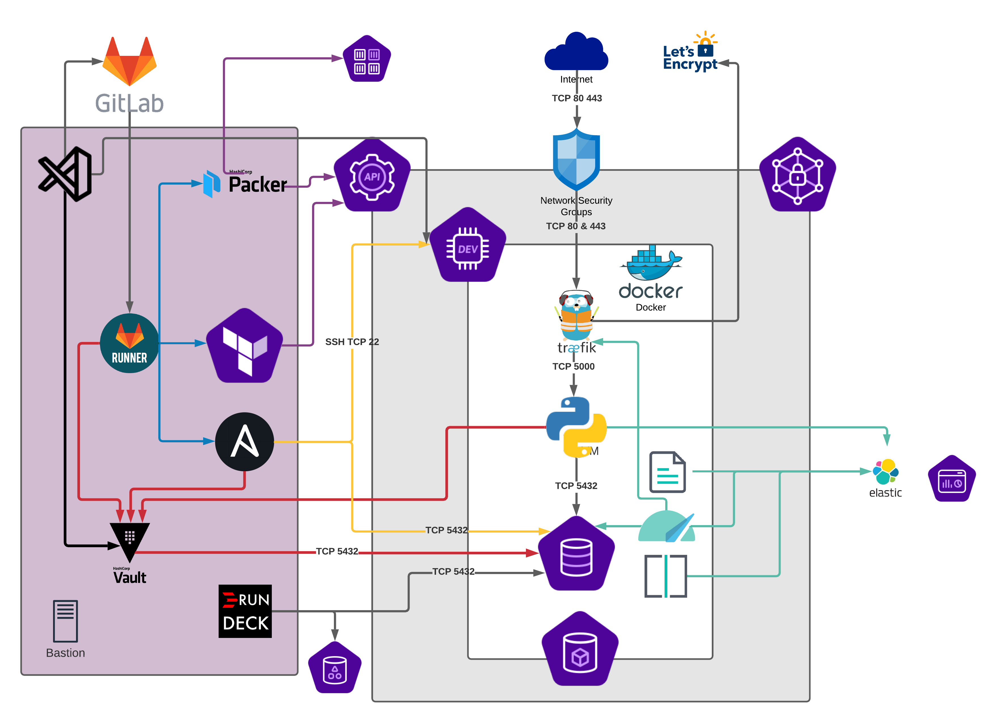

# Le DevSecOps en 2 semaines

## Introduction au DevSecOps

Slides de lundi matin : https://docs.google.com/presentation/d/1C3eGOSHRXs5c2-Smsqq8ZJ-0yClD80lJz4b9R1Gpfa8/edit?usp=sharing

CD/CD by Gitlab : https://docs.gitlab.com/ee/ci/introduction/

## Déroullement du TP

## Requirements

- Laptop Windows 10 / MacOS / Linux
- Chrome ou Edge Chromium

## Architecture

## Week 1

1.  [Setup](1-Setup.md)
2.  [Packer](2-Packer.md)
3.  [Terraform](3-Terraform.md)
4.  [Ansible](4-Ansible.md)
5.  [Package App](5-Package-App-Docker.md)

## Week 2

1.  [Deploy App + DB](6-Deploy-App-and-DB.md)
2.  [Vault](7-Vault.md)
3.  [Monitoring/Observability](8-Monitoring.md)
4.  [Backup / Restore BDD](9-Backup-Restore.md)
5.  **TBD** TLS sur Postgresql ?